# Auditoria visual — TOV Acadêmico (frontend)

**Data:** 2026-09-14
**Branch auditada:** `claude/web-app-visual-audit-raivs6` (a partir de `fcf42ab`)
**Escopo:** tudo que o usuário enxerga — `frontend/src` (47 arquivos, 34 páginas),
`theme.js`, `ui.jsx`, `Layout.jsx`, `index.html`, `fonts.css`, `vite.config.js`.
**Natureza:** auditoria **visual**. Não repete os achados funcionais e de
segurança de `AUDITORIA.md`; quando um defeito visual tem causa no backend,
isso está dito no achado.

---

## Como esta auditoria foi feita

> **A URL de produção não pôde ser acessada.** `https://centro-tov.kafune.xyz/`
> é bloqueada pela política de rede desta sessão (o proxy responde **403** ao
> `CONNECT`, registrado em `recentRelayFailures`). Nada foi contornado.
> Em vez disso **o aplicativo real foi levantado localmente** e auditado:
> `npm run build` de produção (o mesmo bundle minificado, com o
> `check:design` passando) servido por `vite preview`, contra o backend
> FastAPI real rodando sobre SQLite com um banco semeado de 30 alunos,
> 5 professores, 4 turmas, 6 matérias, 56 vínculos matéria×turma, 784 aulas,
> 24 leads, 217 cobranças, 12 transações bancárias e 3 notificações.
> O código é o mesmo que está em produção; o que muda é o servidor.

Nada aqui foi inferido só por leitura. O número de cada achado abaixo veio de
um destes três instrumentos:

**1. Varredura de capturas — 348 combinações.**
29 rotas × 12 larguras (320, 360, 390, 414, 600, 768, 820, 900, 1024, 1280,
1440, 1920), duas capturas por combinação (página inteira e viewport),
**696 imagens**. Larguras < 900 com `isMobile`/`hasTouch` ligados.

**2. Sonda de medição injetada em cada página.** Em cada uma das 348
combinações foram medidos, no DOM renderizado: estouro horizontal da página e
quem o causa; conteúdo cortado por `overflow:hidden`; todo alvo interativo
menor que 44px; contraste de cada nó de texto contra o fundo efetivamente
composto; texto abaixo de 12px; campos sem rótulo acessível; hierarquia de
títulos; erros de console.

**3. Sondas dirigidas.** Onde a captura levantou suspeita, foi feita uma
medição específica: varredura de largura útil de 768px a 1920px, varredura de
altura de 640px a 1080px, rastreamento da ordem de Tab, simulação de falha de
API (abortando só a porta 8000, sem derrubar o app), fonte-raiz do navegador
em 150% e 200%, e uma passagem de contraste dedicada em 25 rotas × 4 larguras
(100 páginas) depois que a primeira composição de camadas alfa se mostrou
errada — **os números de contraste aqui são os da segunda passagem, corrigida.**

A seção **K** lista o que foi investigado e **não** é defeito. Está no relatório
de propósito: são coisas que parecem erradas numa leitura rápida e não são.

---

## Panorama

| Severidade | Qtd. | O que dói |
| --- | --- | --- |
| **Crítico** | 3 | Conteúdo invisível, navegação sem rótulo e sem item ativo |
| **Alto** | 13 | Valor de dinheiro cortado, coluna fora da tela, "Sair" inalcançável |
| **Médio** | 39 | Alinhamento, hierarquia, estados, consistência do sistema |
| **Baixo** | 33 | Polimento, microcópia, densidade |
| **Total** | **88** | |

Dos 88 itens numerados, **85 são defeitos**: C1 é referência cruzada para A1,
e G3/G5 registram resultados positivos onde havia suspeita. A seção **K** traz
mais **13 verificações que deram certo** e não devem ser mexidas.

Cinco achados sozinhos respondem pela maior parte do dano: o cartão branco
sobre canvas em `/alunos/:id` (**A1**), a tabela cortada de 900px a 1600px
(**B1/B2**), a navegação mais alta que a janela — no desktop (**B3**) e no
celular em paisagem (**B12**) — e a barra inferior do celular sem rótulos e
sem item ativo (**A2**).

Três deles (**A2**, **B3**, **B12**) são o mesmo defeito estrutural visto de
três ângulos: **a navegação nunca cabe inteira e os itens que ficam de fora são
sempre os mesmos** — as seções do fim do menu e o botão de sair.

O sistema visual em si é **bom e levado a sério**: `DESIGN_SYSTEM.md` resolve
contradições explicitamente, `theme.js` tokeniza cor, tipo, raio, sombra e
movimento, `check:design` reprova valor fora do sistema no `build`, e há
componentes compartilhados de verdade (`Superficie`, `CabecalhoPagina`,
`BarraFiltros`, `EstadoVazio`, `EstadoErro`, `CardMetrica`). Quase todo achado
abaixo é **uma regra do próprio documento sendo violada em um ponto específico**,
não ausência de sistema. É por isso que a maioria tem correção de uma linha.

### Evidências

As imagens citadas estão em [`docs/auditoria-visual/`](docs/auditoria-visual/).

| # | Arquivo | Achado |
| --- | --- | --- |
| 01 | `01-breakpoint-899-vs-900.png` | B1 |
| 02 | `02-professores-1280-tabela-cortada.png` | B2 |
| 03 | `03-badge-cortado-sem-barra-de-rolagem.png` | B2 |
| 04 | `04-cardresumo-branco-sobre-canvas.png` | A1 |
| 05 | `05-sidebar-cortada-1280x800.png` | B3 |
| 06 | `06-bottomnav-sem-rotulos-320.png` | A2 |
| 07 | `07-snackbar-sobre-a-sidebar.png` | A3 |
| 08 | `08-erro-de-api-vira-estado-vazio.png` | D1 |
| 09 | `09-fonte-do-navegador-em-150pc.png` | F1 |
| 10 | `10-usuarios-separador-invisivel.png` | C2 |
| 11 | `11-dialogo-foco-igual-a-erro.png` | C4, E1 |
| 12 | `12-situacao-cortada-em-900px.png` | B1 |
| 13 | `13-drawer-notificacoes.png` | D6, E4, B3 |
| 14 | `14-aluno-detalhe-360.png` | E2, H5 |
| 15 | `15-carregando-zero-falso.png` | D3 |
| 16 | `16-cardmetrica-desalinhado.png` | A4 |
| 17 | `17-impressao-sem-folha-de-estilo.png` | F5 |
| 18 | `18-coluna-nome-em-coral.png` | E16 |
| 19 | `19-cabecalho-da-grade-de-notas.png` | H10 |
| 20 | `20-quarto-vocabulario-de-escolha.png` | E2 |
| 21 | `21-trilha-em-paisagem.png` | B12 |
| 22 | `22-cabecalho-fixo-que-nao-fixa.png` | H13 |
| 23 | `23-centavos-cortados-no-financeiro.png` | A7 |
| 24 | `24-textarea-cortando-a-ultima-linha.png` | A8 |

---

# A. Defeitos de renderização

Coisas que estão visivelmente erradas na tela, em qualquer largura.

## A1 — CRÍTICO — O cartão "Média geral" renderiza texto branco sobre o canvas claro

**Onde:** `/alunos/:codAlu`, coluna direita do painel do aluno.
**Larguras afetadas:** todas as 12 medidas. Não é um problema de breakpoint.

O cartão que deveria ser a peça escura de destaque da ficha do aluno sai com
**fundo transparente e texto branco**, sobre o canvas `#F5F2EE`:

| elemento | cor | fundo | razão | mínimo WCAG AA |
| --- | --- | --- | --- | --- |
| rótulo "MÉDIA GERAL" | `rgba(255,255,255,.68)` | `rgb(245,242,238)` | **1,08:1** | 4,5:1 |
| valor (44px, peso 700) | `rgb(255,255,255)` | `rgb(245,242,238)` | **1,12:1** | 3:1 |

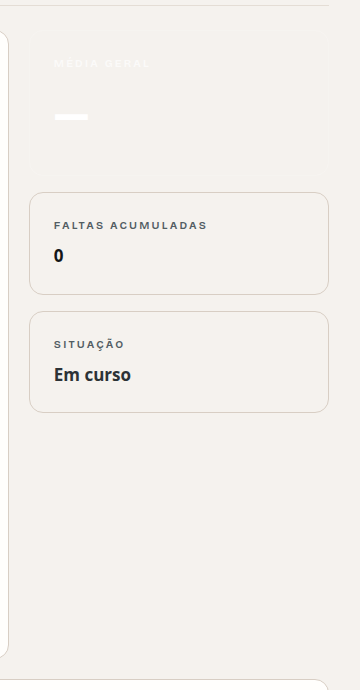

A média do aluno — o número mais consultado da ficha — é literalmente
invisível. O cartão de baixo ("FALTAS ACUMULADAS") mostra como deveria ficar.

**Causa exata.** `frontend/src/pages/AlunoDetalhe.jsx:31`:

```jsx
<Superficie variante={escuro ? 'inverse' : 'base'} sx={{ bgcolor: offwhite ? TOV.canvas : undefined, p: '24px' }}>
```

`Superficie` (`ui.jsx:340`) monta o estilo como
`{ borderRadius, ...SUPERFICIES[variante], ...sx }`. A variante `inverse`
define a chave **`bgcolor`** (`ui.jsx:332-333`), e o `sx` espalhado depois traz a
**mesma chave** com valor `undefined`. Espalhamento de objeto não ignora
`undefined`: `{bgcolor: graphite, ...{bgcolor: undefined}}` resulta em
`{bgcolor: undefined}`. O grafite é apagado; a cor de texto `TOV.onDark`, que
vem de outra chave, sobrevive.

É a **única** ocorrência de `Superficie` recebendo `bgcolor` no `sx` em todo o
frontend — o erro está contido em um arquivo.

**Correção:** não passar a chave quando não há valor.
```jsx
<Superficie variante={escuro ? 'inverse' : 'base'} sx={{ ...(offwhite ? { bgcolor: TOV.canvas } : null), p: '24px' }}>
```
Opcionalmente, blindar `Superficie` filtrando chaves `undefined` do `sx`.

---

## A2 — CRÍTICO — A barra inferior do celular não mostra rótulo em 3 dos 4 itens e nunca marca a página atual

**Onde:** `Layout.jsx:601-627`. Todo perfil exceto `FINANCEIRO`, em `xs` (< 600px).

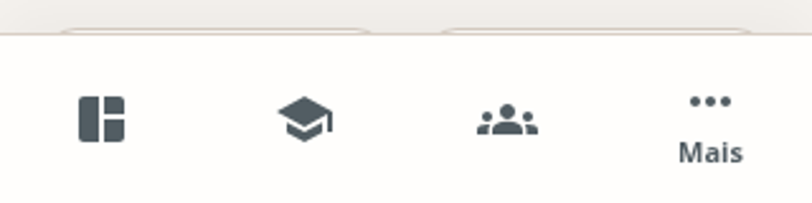

Medido no DOM em `/` a 320×640:

| item | `opacity` do rótulo | `padding-top` | `Mui-selected` |
| --- | --- | --- | --- |
| Início | **0** | 14px | não |
| Alunos | **0** | 14px | não |
| Turmas | **0** | 14px | não |
| Mais | 1 | 0px | não |

O rótulo existe no DOM com `opacity: 0` e a classe
`MuiBottomNavigationAction-iconOnly`. A passagem de contraste confirma o mesmo
em **20 rotas**. Consequências:

1. Três dos quatro atalhos do celular são **só um ícone**, sem texto.
2. **Nenhum item jamais fica ativo.** Em `/` (dashboard) nada acende; em
   `/calendario` acende "Mais", porque "Mais" é o único item que recebe o
   `value`. A regra `'& .Mui-selected': { color: TOV.coral }` e o filete coral
   do `::before` (`Layout.jsx:596-598`) nunca chegam a valer para os outros.

**Causa exata.** `BottomNavigation` distribui `showLabel`, `selected` e
`value` com `React.Children.map` sobre os **filhos diretos**. Em
`Layout.jsx:602-624` as ações estão dentro de **fragmentos** (`<>…</>`) dos
ramos condicionais; o fragmento é um filho só, e as ações lá dentro nunca
recebem as props. `<BottomNavigationAction label="Mais" …/>` (linha 625) é
filho direto e por isso funciona — e o perfil `FINANCEIRO`, que tem uma ação
única sem fragmento (linha 610), também funciona. Isso explica exatamente o
padrão observado.

**Correção:** trocar os fragmentos por arrays achatados, para que as ações
sejam filhos diretos do `BottomNavigation`.

---

## A3 — ALTO — O Snackbar de erro cai em cima da sidebar e fica ilegível

**Onde:** 21 das 23 páginas que usam `<Snackbar>`. Reproduzido em `/alunos` a 1280×800.

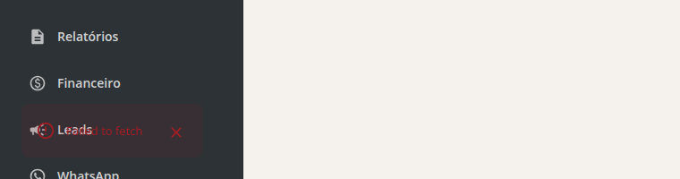

Dois problemas se somam:

1. **Ancoragem.** 21 de 23 `<Snackbar>` não declaram `anchorOrigin`, então
   usam o padrão do MUI: **bottom-left** — exatamente onde fica a sidebar de
   272px. Só `OfflineScreen.jsx:21` (bottom/center) e `Alunos.jsx:330`
   (bottom/right, e é o de sucesso, não o de erro) escolhem posição.
2. **Fundo translúcido.** `theme.js:478` define
   `standardError: { backgroundColor: TOV.dangerTint }`, e `dangerTint` é
   `rgba(168,28,36,.10)` — 10% de opacidade. É um tom pensado para superfície
   clara; sobre a sidebar grafite ele deixa o fundo passar inteiro. As quatro
   variantes `standard*` do tema (`theme.js:478-481`) usam tints translúcidos,
   então **todo** alerta em Snackbar tem o mesmo problema.

O resultado é o rótulo "Leads" da sidebar atravessando as palavras do erro.
O texto vermelho-escuro sobre grafite fica em torno de 1,2:1.

**Correção:** ancorar os Snackbars fora da sidebar (bottom/right, ou
bottom/center com offset) **e** dar ao alerta dentro de Snackbar um fundo
opaco. As duas coisas — só mover não resolve sobrepor conteúdo claro, só
opacificar não resolve tapar a navegação.

**E o padrão certo já existe no repositório.** `OfflineScreen.jsx:20-31` faz
exatamente as três coisas: `anchorOrigin: { vertical: 'bottom', horizontal:
'center' }`, `variant="filled"` (fundo opaco, `TOV.warning` com texto branco a
6,3:1) e `bottom: { xs: 'calc(78px + env(safe-area-inset-bottom))', sm: 24 }`,
que sobe a faixa acima da navegação inferior do celular. Verificado em 390px e
1280px: o aviso de "sem conexão" aparece legível, centralizado e sem tapar
nada. É esse componente que os outros 21 deveriam imitar.

---

## A4 — MÉDIO — Os números dos `CardMetrica` desalinham quando um rótulo quebra linha

**Onde:** componente `CardMetrica` (`ui.jsx:449`); visível em `/` (dashboard),
`/turmas/:id/diario`, `/financeiro`, `/professor`.

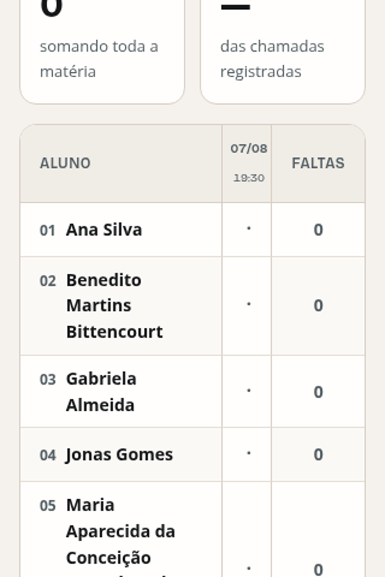

O rótulo (`Eyebrow`, 11px) não tem altura reservada. Numa grade de quatro
cartões, basta um rótulo com duas ou três linhas ("CHAMADAS NÃO ENCERRADAS",
"AULAS REGISTRADAS") para que **o número daquele cartão desça** e a linha de
números deixe de ter uma base comum. Em `/turmas/1/diario` a 320px:
"ALUNOS" põe o 9 numa altura, "AULAS REGISTRADAS" põe o 0 uns 40px abaixo.

Some com a largura: a 1920px, onde todos os rótulos cabem em uma linha, a
grade alinha perfeitamente. O defeito é função da largura, não do dado.

**Correção:** `min-height` no bloco do rótulo equivalente a duas linhas, ou
`display: grid` com `grid-template-rows: auto 1fr auto` no cartão.

---

## A5 — MÉDIO — O filete coral do item ativo da navegação é desenhado por cima do canto arredondado

**Onde:** `Layout.jsx:110-113` (`ItemNav`) e `Layout.jsx:80-83` (`ItemTrilha`).

O marcador de página atual é um `::before` de 4px em `left: 0` dentro de um
botão que tem `borderRadius: TOV.radiusSm` e fundo branco. Como o filete é
retangular e o botão é arredondado, sobra uma lasca coral quadrada encostada
num canto redondo. Na trilha do tablet é pior: `left: -8` coloca o filete
exatamente em `x = 0` da tela, e ele fica cortado pela borda da janela
(visível em `/alunos` a 768px).

**Correção:** aplicar o mesmo raio ao filete, ou movê-lo para fora do botão,
como faz `ui.jsx` no `CardMetrica` (`inset: '0 auto 0 0'` dentro de um
container com `overflow: hidden`).

---

## A6 — BAIXO — O em-dash de "sem valor" vira uma barra preta grossa no `CardResumo`

**Onde:** `AlunoDetalhe.jsx:33`, `/turmas/:id/diario`.

Quando não há dado, o valor exibido é `—` renderizado na mesma escala do
número (44px em `CardResumo`, 32px em `CardMetrica`, peso 700). Um travessão
nesse corpo vira uma barra sólida de ~40px de largura, que lê como tarja de
censura e não como "sem informação".

**Correção:** estado vazio próprio para métrica — o traço em corpo de texto e
cor `caption`, não em corpo de display.

## A7 — ALTO — No painel financeiro, os centavos são cortados em 1280, 1366 e 1440px

Os quatro `CardMetrica` de `/financeiro` cortam o valor monetário no seco —
sem reticências, sem quebra de linha, sem reduzir o corpo — porque o
`Superficie` do `CardMetrica` tem `overflow: hidden` e a fonte fica em
`TOV.type.display` (40px) de 900px para cima, sem nenhum passo intermediário.

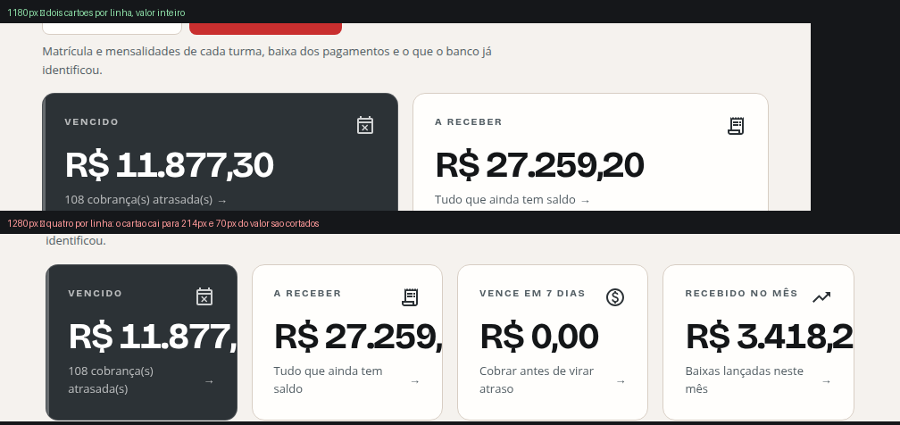

Varredura de largura, medindo `scrollWidth − clientWidth` do valor "R$ 11.877,30":

| largura da janela | largura do cartão | quanto do valor fica de fora |
| --- | --- | --- |
| 900px | 270px | **14px** |
| 960px | 298px | 0 |
| 1000–1180px | 316→399px | 0 |
| **1200px** | **196px** | **88px** |
| 1250px | 208px | 76px |
| **1280px** | 214px | **70px** |
| **1366px** | 234px | **50px** |
| **1440px** | 251px | **33px** |
| 1500px | 265px | 19px |
| 1600px e acima | 288px+ | 0 |

O produto exibe **"R$ 11.877,"**, **"R$ 27.259,"** e **"R$ 3.418,2"** — valores
truncados no meio da casa decimal, na tela que a tesouraria abre primeiro, nas
três resoluções de desktop mais comuns.

**Causa e regressão.** Em `lg` (1200px) a grade sai de 2 para 4 colunas. O
cartão despenca de **399px para 196px** — metade da largura — enquanto o valor
continua em 40px. É o mesmo padrão de **B1**: uma janela mais larga mostra
menos informação que uma mais estreita, e aqui o que se perde é dinheiro.

Não afeta o celular: em `xs` a fonte é `displaySm` (32px) e o cartão tem 288px
a 320px, com folga (ver **K1**).

**Correção:** um passo de corpo em `lg`, ou `container queries`/`clamp()` no
valor, ou trocar o `overflow: hidden` por redução de escala. Qualquer coisa
menos cortar o número.


## A8 — MÉDIO — O campo "Instruções para o aluno" corta a última linha ao meio no primeiro render

Em `/financeiro/conciliacao` a 320px, o texto salvo pela tesouraria aparece com
a terceira linha **fatiada na horizontal** — só a metade de cima de "PIX." é
visível, e ainda sobra espaço vazio embaixo dentro da própria caixa:

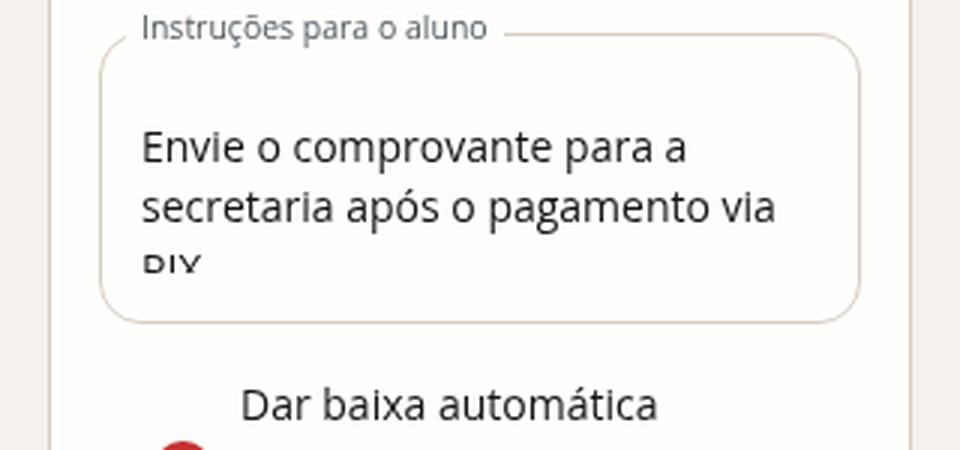

Medido: `scrollHeight = 84px`, `clientHeight = 64px`, `overflow: hidden`,
`resize: none` → **20px de texto escondidos, sem rolagem e sem alça para
crescer**.

**Causa.** `FinanceiroConciliacao.jsx:185-190` usa
`<TextField fullWidth multiline minRows={2} …>`. O autoajuste do MUI calcula a
altura na montagem, quando o valor ainda está vazio, e crava
`style="height: 40px"` (duas linhas). O valor chega **depois**, pela API, e a
altura não é recalculada.

Verificado nos dois sentidos:

| momento | altura | texto escondido |
| --- | --- | --- |
| valor vindo da API (320px) | 64px (`height: 40px` inline) | **20px** |
| mesmo campo, depois de o usuário digitar | 185px (`height: 161px`) | 0 |

Ou seja: **digitar um caractere conserta**. O defeito existe só enquanto o
usuário apenas *lê* o que já estava salvo — que é o caso comum.

Nesta auditoria a fatia só apareceu em 320px, porque nas outras larguras o
texto semeado cabe em duas linhas. O campo aceita `maxLength: 2000`, então com
uma instrução real de quatro ou cinco linhas o corte acontece em qualquer
largura.


---

# B. Responsividade e breakpoints

## B1 — ALTO — Cruzar 900px **piora** o layout: a área útil cai 215px e a tabela passa a ser cortada

Este é o achado de maior alcance do relatório, porque atinge **toda página com
tabela**.

Em `md` (900px) a sidebar de 272px substitui a trilha de 72px, e o `padding`
do `main` sobe de 28px para `clamp(36px,4vw,64px)`. O conteúdo perde 200px de
navegação e mais 16px de respiro **de um pixel para o outro**:

| largura | navegação | largura útil | tabela `/alunos` | cortado |
| --- | --- | --- | --- | --- |
| 768px | trilha 72px | 640px | 760px | 122px |
| 820px | trilha 72px | 692px | 760px | 70px |
| 880px | trilha 72px | 752px | 760px | 10px |
| **899px** | trilha 72px | **771px** | 769px | **0 — cabe inteira** |
| **900px** | sidebar 272px | **556px** | 760px | **206px** |
| 1000px | sidebar 272px | 648px | 760px | 114px |
| 1100px | sidebar 272px | 740px | 760px | 22px |
| 1200px | sidebar 272px | 832px | 830px | 0 |

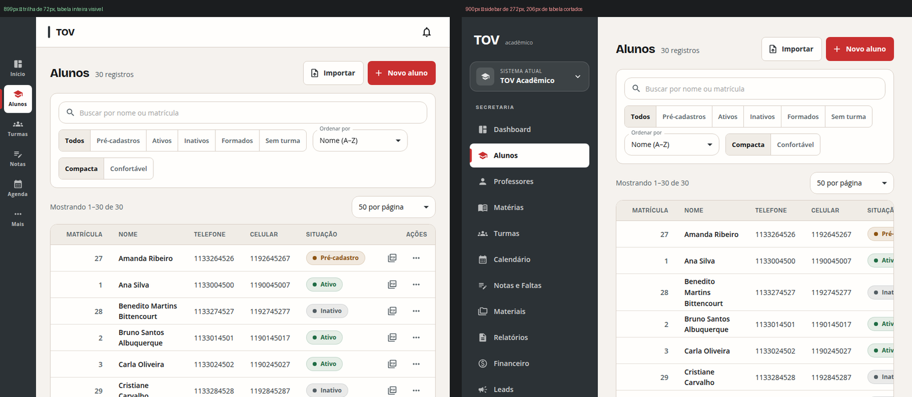

A 899px a tabela cabe inteira, com a coluna AÇÕES. A 900px a coluna SITUAÇÃO é
cortada no meio da palavra e AÇÕES some da tela. **Existe uma faixa morta de
~280px (900–1180px) em que a janela mais larga mostra menos informação que a
mais estreita.**

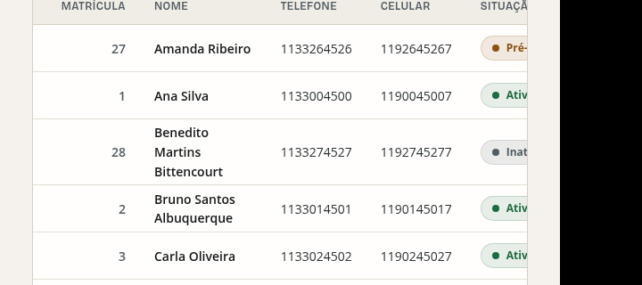

Medido em 900×900, o mesmo corte em todas as páginas com tabela:

| rota | largura da tabela | cortado | colunas que somem |
| --- | --- | --- | --- |
| `/professores` | 1140px | **586px** | e-mail, acesso, áreas, status, "Criar acesso · Editar" |
| `/turmas/:id/diario` | 1066px | **512px** | metade das colunas de aula |
| `/financeiro` | 900px | **346px** | valor, saldo, situação, ação |
| `/leads` | 763px | 209px | funil, consentimento, "Editar" |
| `/alunos` | 760px | 206px | situação, ações |
| `/turmas/:id` | 720px | 166px | e-mail, ações |
| `/materias` | 680px | 126px | área, "Editar · Excluir" |

Em **todos** os casos a coluna que cai fora é a de **ações**.

**Correção (uma linha, a mais barata):** subir a sidebar completa para `lg`
(1200px) em `Layout.jsx:543`, mantendo a trilha de ícones até lá. A tabela de
`/alunos` passa a caber em toda a faixa. Alternativas: sidebar recolhível, ou
priorização/ocultação de colunas por largura.

---

## B2 — ALTO — Em 1280px, a página `/professores` esconde a coluna de ações e não mostra barra de rolagem

O problema de B1 não termina em 1180px. Medido:

| largura | largura útil | tabela `/professores` | cortado |
| --- | --- | --- | --- |
| 1024px | 670px | 1140px | 472px |
| **1280px** | 906px | 1140px | **236px** |
| 1440px | 1053px | 1140px | 89px |
| 1600px | 1200px | 1198px | 0 |

**1280×800 é a resolução de notebook mais comum.** Nela, a coluna AÇÕES
("Criar acesso · Editar") de `/professores` está inteiramente fora da tela e
os selos de status são cortados no meio da letra:

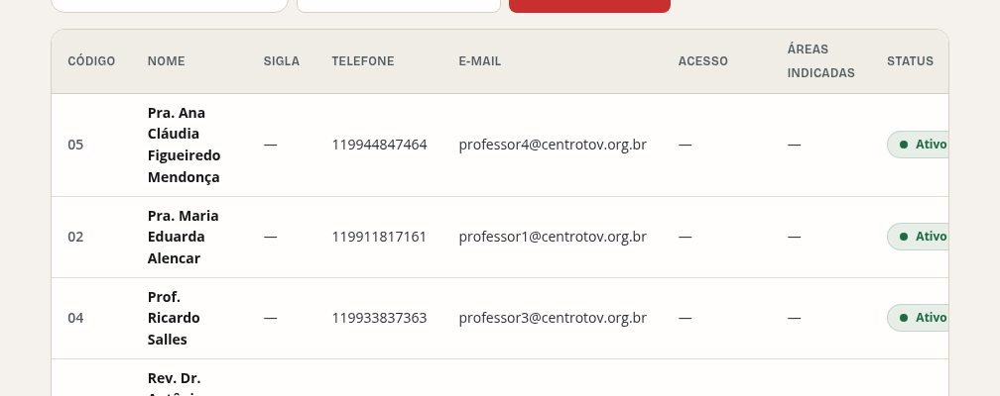
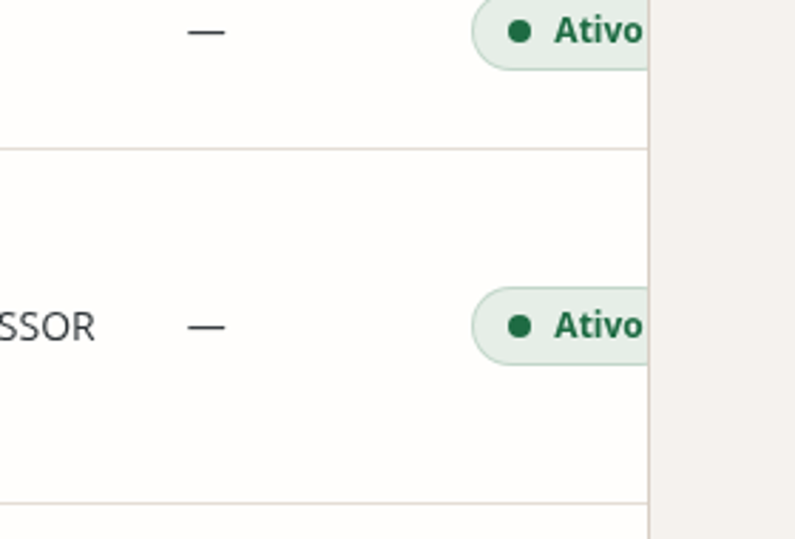

Não há **nenhuma** dica de que a tabela rola: sem sombra de borda, sem
gradiente de recorte, sem seta. O `MuiTableContainer` tem `overflowX: auto`,
mas a barra de rolagem fica no rodapé do container — abaixo da dobra em
qualquer tela de 800px. O usuário vê um corte seco contra o canvas.

`/turmas/:id/diario` tem o mesmo perfil (corta até ~1455px).

**Agravante de conteúdo:** a coluna NOME — a única que importa para escanear —
é a mais espremida (o nome quebra em 4 linhas), enquanto SIGLA, ACESSO e ÁREAS
INDICADAS, todas com "—" em quase toda linha, recebem largura fixa generosa.

**Correção:** afordância de rolagem (máscara/sombra nas bordas do container é o
padrão) **e** revisão da distribuição de colunas; colunas vazias não deveriam
disputar espaço com o nome.

---

## B3 — ALTO — A sidebar do desktop é mais alta que a tela: o botão "Sair" fica fora da vista em todo notebook

**Onde:** `Layout.jsx:538-548` (sidebar) e `Layout.jsx:491-497` (gaveta do celular).

A sidebar do perfil ADMIN tem **974px de altura de conteúdo** (logo + seletor
de sistema + rótulo de seção + 13 itens + rodapé). Ela é
`height: '100vh'` com `overflowY: 'auto'`, então rola por dentro — sem barra
visível, sem sombra, sem qualquer sinal.

Medido em `/`:

| altura da janela | itens de menu cortados | rodapé (sino, avatar, **Sair**) visível? |
| --- | --- | --- |
| 640px | Relatórios, Financeiro, Leads, WhatsApp, Usuários | **não** |
| 700px | Financeiro, Leads, WhatsApp, Usuários | **não** |
| 768px | Leads, WhatsApp, Usuários | **não** |
| **800px** | WhatsApp, Usuários | **não** |
| 900px | nenhum | **não** |
| 1080px | nenhum | sim |

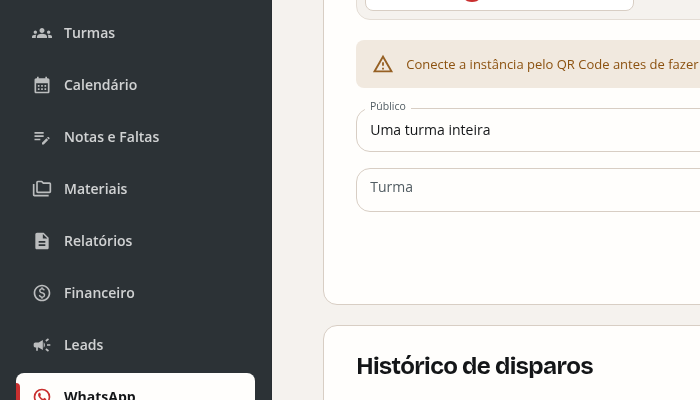

Em 1280×800 (MacBook Air, e a altura mais comum de notebook depois do chrome
do navegador) **o botão de sair, o avatar do usuário e o sino de notificações
estão abaixo da dobra de uma barra que não parece rolável.** Na captura acima,
o item ativo é `WhatsApp` — e ele próprio aparece cortado ao meio.

O `mt: 'auto'` do rodapé (`Layout.jsx:399`) é o que mascara o problema: num
flex container que transborda, `margin-top: auto` não empurra o rodapé para a
base visível, apenas o posiciona depois do conteúdo — ou seja, fora da tela.

**Na gaveta do celular é igual.** A 360×740, "Financeiro" é o último item
visível; Leads, WhatsApp, Usuários, o botão de instalar PWA e todo o rodapé com
o "Sair" ficam abaixo, sem indicação.

O perfil PROFESSOR, com 4 itens, não sofre — e isso confirma a causa.

**Correção:** separar a lista rolável do rodapé fixo — `nav` com
`flex: 1 1 auto; overflow-y: auto` e o rodapé como irmão fora da área rolável.
Uma máscara de recorte no topo/base da lista resolve a afordância.

---

## B4 — MÉDIO — `/alunos/:codAlu` estoura 92px na horizontal em 900px

Única página com **rolagem horizontal da janela inteira** na varredura:

```
aluno-detalhe @900 → document.scrollWidth − window.innerWidth = 92px
   div "Média geral—Faltas acumuladas0SituaçãoEm curso"  right = 992 (tela = 900)
   section "Média geral—"                                right = 992
```

A coluna lateral de 300px do grid `{ xs: '1fr', md: '1fr 300px' }`
(`AlunoDetalhe.jsx:197`) entra em `md` (900px) quando a área útil é só 556px —
`1fr` não consegue encolher abaixo do conteúdo mínimo do bloco de dados
cadastrais, e a linha estoura. Mesma raiz de B1.

**Correção:** postergar a coluna lateral para `lg`, ou dar
`minmax(0, 1fr)` na primeira faixa.

---

## B5 — MÉDIO — `/leads` estoura 8px em 1280px

```
leads @1280 → overflowX = 8px, causado por div.MuiTextField-root "Funil"
```

O último campo da barra de filtros passa 8px da borda direita. Pequeno, mas é
rolagem horizontal de página inteira numa largura de desktop comum.

---

## B6 — MÉDIO — Páginas de rolagem infinita no celular

Altura da página inteira a 320px, sem paginação nem virtualização:

| rota | altura |
| --- | --- |
| `/calendario` | **17.915px** (28 telas) |
| `/agenda/:token` | **15.746px** |
| `/financeiro` | **12.939px** |
| `/leads` | 6.704px |
| `/alunos` | 4.537px |
| `/financeiro/conciliacao` | 4.408px |

`/financeiro` traz 217 cobranças numa lista única. `/calendario` desenha o mês
inteiro em agenda cronológica. Em campo, com mais dados, isso cresce
linearmente.

**Correção:** a paginação que já existe em `/alunos` ("50 por página") aplicada
às demais listas; no calendário, recorte por semana no celular.

---

## B7 — BAIXO — A trilha do tablet não tem saída de sessão nem identificação do usuário

Entre 600px e 899px a navegação é a trilha de 72px (`Layout.jsx:512-535`), que
tem **só os ícones de rota e o "Mais"**. O avatar, o perfil e o botão "Sair"
existem apenas dentro da gaveta. Num iPad em retrato, sair do sistema exige
descobrir que "Mais" abre um menu que tem um rodapé que rola.

---

## B8 — BAIXO — Em 320px o controle segmentado é cortado sem nenhuma dica de rolagem

`GrupoSegmentado` (`ui.jsx:78-90`) tem `overflowX: 'auto'` com
`scrollbarWidth: 'none'` e `'&::-webkit-scrollbar': { display: 'none' }`.
Em `/alunos` a 320px o usuário vê `Todos | Pré-cadastros | Ativos | In…`
cortado no meio de "Inativos", e **nada** sugere que existam "Formados" e
"Sem turma" à direita. Esconder a barra é uma decisão estética legítima; sem
nenhuma afordância no lugar dela, vira conteúdo perdido.

## B9 — MÉDIO — Entre 600px e 767px o produto usa navegação de tablet com lista de celular

A trilha de ícones entra em `sm` (600px), mas a troca de cartões por tabela só
acontece em `tablet` (768px) — `useTelaDesktop` é
`breakpoints.up('tablet')` (`ui.jsx:34-37`). Na faixa de 168px entre os dois,
o usuário tem a navegação do tablet e a lista do celular.

Em `/alunos` a 600px cada cartão ocupa **705px de largura** para exibir três
dados — nome, matrícula e celular — com cerca de 400px de vazio no meio de
cada linha. A tabela equivalente cabe folgada (a 768px ela já é usada, com
640px úteis). São 30 cartões, cada um com o triplo da altura da linha
correspondente.

Na mesma largura, o `GrupoSegmentado` continua cortado ("Sem…") mesmo com
673px disponíveis, porque sua largura natural passa de 680px — e sem
afordância, como em **B8**.


## B10 — ALTO — Célula de tabela não quebra token longo: um e-mail realista piora o corte em mais 365px

As células herdam `overflow-wrap: normal` e `word-break: normal` — o tema não
os define em `MuiTableCell` (`theme.js:375-400`). Uma sequência sem espaço
(e-mail, URL, nome sem espaço) **não pode quebrar**, então força a coluna a
crescer e empurra as demais para fora.

Medido substituindo uma célula por
`nome.sobrenome.composto.muito.longo@subdominio.instituicao.educacional.org.br`
(76 caracteres, perfeitamente realista):

| rota (1280px) | corte antes | corte depois | piora |
| --- | --- | --- | --- |
| `/professores` | 236px | **601px** | **+365px** |
| `/leads` | **0px (cabia)** | **289px** | **+289px** |
| `/alunos` | 0px | 304px | +304px |

`/leads` cabe hoje em 1280px e **deixa de caber** por causa de um único
endereço de e-mail. `/professores` perde mais da metade da tabela.

O mesmo teste com um nome longo *com espaços* (98 caracteres) se comporta bem:
quebra em quatro linhas, a altura da linha vai de 53px para 96px, nada estoura.
O problema é estritamente o token indivisível.

Isso transforma **B1** e **B2** em defeitos que **pioram com dados reais**: a
medição base desta auditoria usou e-mails curtos de teste
(`professor4@centrotov.org.br`). Em produção, com endereços institucionais
completos, o corte é maior do que os números das tabelas de B1/B2.

**Correção:** uma regra no tema —
`MuiTableCell: { styleOverrides: { root: { overflowWrap: 'anywhere' } } }`.
O sistema já usa `overflowWrap: 'anywhere'` em `CabecalhoPagina` (`ui.jsx:283`),
`LinhaCartao` e `DialogoConfirmacao`; falta na tabela, que é onde mais importa.


## B11 — BAIXO — Nenhuma reserva de calha de barra de rolagem entre páginas

`scrollbar-gutter` não é declarado em lugar nenhum (medido: `auto` na raiz).
As alturas de página em 1280×800 ficam exatamente nos dois lados do limiar:

| rota | altura da página | rola? |
| --- | --- | --- |
| `/usuarios` | 800px | não |
| `/materiais` | 800px | não |
| `/alunos` | 1.994px | sim |
| `/financeiro` | 6.930px | sim |

Em sistemas com barra de rolagem clássica (Windows, a maioria dos Linux
desktop), navegar de `/usuarios` para `/alunos` estreita a área de conteúdo
em ~15px e desloca a página inteira na horizontal. Em macOS, com barra
sobreposta, não acontece nada.

> **Não reproduzido neste ambiente.** O Chromium headless usado na auditoria
> tem barra sobreposta (`innerWidth − clientWidth = 0` em todas as rotas), então
> o salto não pôde ser medido. O que está medido é o dado que o provoca: as
> alturas acima cruzam o limiar. `scrollbar-gutter: stable` na raiz elimina o
> risco sem custo.


## B12 — ALTO — Em celular na horizontal, "Mais" some — e com ele nove seções e o botão de sair

Ao girar o celular, a largura passa de ~390px para ~740–850px e o layout troca
a barra inferior pela **trilha de ícones do tablet**. A trilha precisa de
**448px de altura**; a janela tem 320–414px.

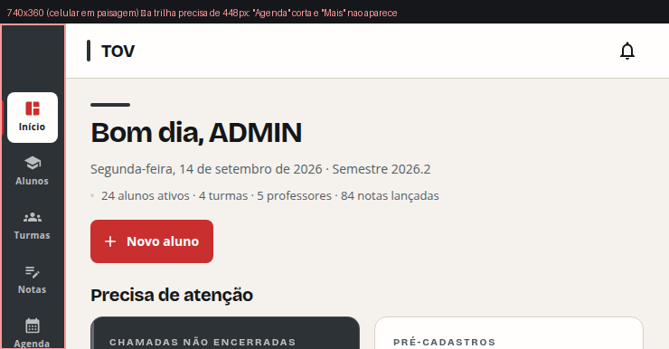

Medido em 740px de largura, variando a altura:

| altura da janela | itens da trilha cortados |
| --- | --- |
| 320px (iPhone SE em paisagem) | Agenda, **Mais** |
| 360px | Agenda, **Mais** |
| 390px | **Mais** |
| 414px | **Mais** |
| 480px | nenhum |

**"Mais" fica fora da tela em toda altura abaixo de 480px** — e "Mais" é a
única porta para Professores, Matérias, Calendário, Materiais, Relatórios,
Financeiro, Leads, WhatsApp, Usuários, o botão de instalar o PWA, as
notificações e o **sair**. Em paisagem, nove das catorze seções do produto
ficam inalcançáveis sem descobrir que uma faixa de ícones de 72px rola na
vertical.

A conta é direta: 6 itens × 60px + `pt: 'calc(76px + env(safe-area-inset-top))'`
(`Layout.jsx:513`) + 16px embaixo = 452px. E esses 76px de topo existem para
descontar uma AppBar que mede **61px** — 15px a mais do que o necessário.

É a mesma raiz de **B3** (conteúdo de navegação mais alto que a janela,
`overflow-y: auto`, sem afordância, com os itens críticos no fim), agora na
orientação em que mais dói.


## B13 — BAIXO — O seletor de matéria fica truncado mesmo com 473px livres ao lado

`/materiais`, campo "Matéria e turma" (`Materiais.jsx:194`):

```jsx
sx={{ flex: '1 1 330px', maxWidth: 560 }}
```

O `maxWidth: 560` impede o campo de crescer, mesmo quando a linha tem espaço
de sobra. Medido:

| largura da janela | largura do campo | texto precisa de | perdido | espaço livre na mesma linha |
| --- | --- | --- | --- | --- |
| 1280px | 435px | 580px | **145px** | 58px |
| 1920px | **560px** (no teto) | 580px | **20px** | **473px** |

Em 1920px sobram 473px vazios ao lado e o rótulo continua com reticências:
`Grego Koiné Instrumental · Turma 2025.2 — Bacharel em …`. É a única coisa na
tela que diz de qual matéria e de qual turma são os materiais listados.


---

# C. Contraste e legibilidade

Passagem dedicada: 25 rotas × 4 larguras, composição correta de camadas alfa,
critério WCAG 2.1 AA (4,5:1 normal, 3:1 para ≥24px ou ≥18,66px em peso ≥700).
**465 ocorrências abaixo do mínimo, em 12 combinações distintas de cor.**

## C1 — CRÍTICO — Ver **A1** (1,08:1 e 1,12:1)

O pior contraste do sistema. Documentado na seção A por ser um defeito de
renderização, não uma escolha de paleta.

## C2 — ALTO — `TOV.border` usado como cor de **texto**: 1,54:1, 117 ocorrências

`#D8CEC4` é o token de **borda**. Ele aparece como `color` de texto em:

| rota | elemento | ocorrências |
| --- | --- | --- |
| `/materias`, `/professores`, `/usuarios` | separador `·` entre ações da tabela | 63 |
| `/usuarios` | rótulo do botão **"Excluir"** desabilitado | (no mesmo grupo) |
| `/financeiro` | marcador `—` de célula sem valor | 54 |

Razão: **1,54:1** contra `#FFFEFC`. Na prática é invisível.

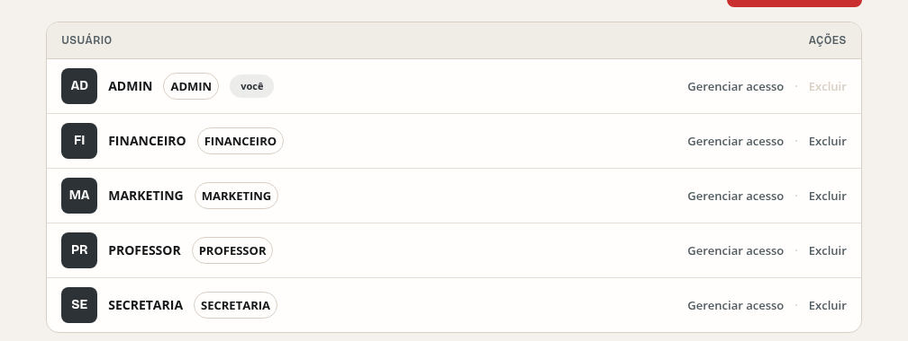

Duas consequências distintas: o `·` some (e "Gerenciar acesso Excluir" lê como
uma coisa só), e o `—` de célula vazia some (a coluna parece um bug de dados,
não um "não informado").

**Correção:** `TOV.caption` (`#525D63`, 6,6:1) para o separador e para o traço;
`TOV.border` fica só em `border`.

## C3 — ALTO — Estados desabilitados herdam o padrão do MUI e ficam entre 1,42:1 e 2,90:1

O tema customiza cor, tipo, raio, sombra e movimento — mas não toca o
desabilitado, que fica em `alpha(TOV.caption, .6)` (`theme.js:173`).

| razão | onde | exemplo |
| --- | --- | --- |
| **1,42:1** | `/relatorios` | "Gerar ZIP" (contido, sobre grafite) |
| **2,44:1** | `/turmas/:id/presencas` | "Iniciar chamada no iPad" |
| **2,55:1** | `/calendario`, `/financeiro/alunos/:id`, `/whatsapp` | "Baixar XLSX", "Salvar desconto", "Continuar para mensagem" |
| **2,71:1** | `/financeiro`, `/professores`, `/usuarios`, `/notas` | "Acesso criado", "Anterior", "Excluir", "Diário (PDF)" |
| **2,90:1** | `/relatorios` | "Boletim", "Histórico escolar", "Ficha cadastral" |

A WCAG isenta controles desabilitados do mínimo — mas **2,55:1 não comunica
"desabilitado", comunica "quebrado"**. `/relatorios` abre com cinco botões
nesse estado e a página inteira parece não ter carregado. E há um efeito
perverso repetido: em `/financeiro/alunos/:id` o "Salvar desconto"
(desabilitado, cinza sobre cinza) fica ao lado de "Remover desconto" (coral,
destrutivo) — **a ação destrutiva é a única visível**.

**Correção:** um token `TOV.disabled` com razão ≥ 3:1 e um tratamento único
para `contained` e `outlined` desabilitados. Hoje os dois são
visualmente muito diferentes entre si (ver E6).

## C4 — MÉDIO — Foco e erro são a mesma cor vermelha

`focusRing` é `3px solid alpha(TOV.coral, .25)` com o `notchedOutline` indo a
`TOV.coral` `#C92F2F`; `Mui-error` vai a `TOV.danger` `#A81C24`. São dois
vermelhos a 8 pontos de matiz de distância, ambos com anel/borda vermelha.

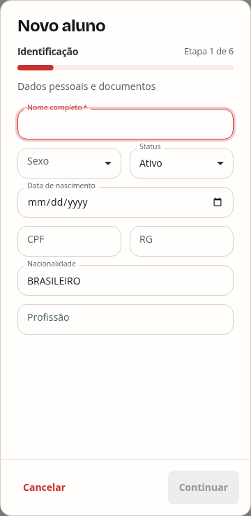

No diálogo "Novo aluno", o campo com `autoFocus` abre já vermelho — parece
recusado antes de o usuário digitar. Em `/alunos`, digitar na busca acende o
mesmo vermelho. A escolha de "coral funcional" do `DESIGN_SYSTEM.md` é
deliberada e boa; o problema é que ela colide com o único outro sinal
vermelho do sistema.

**Correção:** diferenciar a *forma*, não só o tom — anel de foco em coral com
`outline-offset`, estado de erro com filete de 2px na borda inferior + ícone,
ou anel de foco em grafite quando o campo já está em erro.

## C5 — MÉDIO — 11px é o corpo de texto de duas telas inteiras

`TOV.type.overline` (11px) e `TOV.type.micro` (10px) não são usados só como
sobrelinha:

| tamanho | onde | ocorrências |
| --- | --- | --- |
| 11px | **todo o texto dos blocos de aula** na grade do calendário (`pages/CalendarioGrade.jsx:179,182`) — turma *e* matéria | 2.389 nas rotas de calendário |
| 11px | rótulos da barra inferior, "Administrador", `Eyebrow` de todo `CardMetrica` | restante das 3.670 ocorrências de 11px |
| 10px | rótulos da trilha do tablet, hora "19:30" da agenda, "SISTEMA ATUAL" | 696 |

A grade mensal do calendário — em `/calendario` e na página pública
`/agenda/:token` — é **inteiramente** 11px. Não é um detalhe de rodapé: é o
conteúdo principal da tela.

## C6 — BAIXO — `GrupoSegmentado` não marca a opção ativa por nada além de tom

A opção selecionada difere por `bgcolor: TOV.surfaceMuted` (`#F0ECE6` sobre
`#FFFEFC`) e peso 700 vs 600. Contra o canvas, a diferença de superfície é de
~2% de luminância. Funciona, mas é o sinal mais fraco de "estado ativo" do
sistema — compare com o filete coral de 4px da navegação.

## C7 — BAIXO — Status da grade do calendário é comunicado **só** por cor

`pages/CalendarioGrade.jsx:21-25`:

```js
function corEvento(status) {
  if (status === 'CANCELADA') return { bg: TOV.captionTint, color: TOV.caption }
  if (status === 'REALIZADA') return { bg: TOV.graphiteTint, color: TOV.graphite }
  return { bg: TOV.infoTint, color: TOV.info }
}
```

Na grade mensal, uma aula **cancelada** e uma aula **realizada** diferem apenas
por dois cinzas próximos. Nenhum texto, ícone ou padrão. A regra 4 do
`DESIGN_SYSTEM.md` diz literalmente "cor nunca é o único indicador" — e a
visão de agenda do celular (`pages/CalendarioGrade.jsx:121`) faz certo, imprimindo
`STATUS[aula.status]`. As duas visões da mesma informação discordam.

## C8 — MÉDIO — O selo de nota usa o tom `success` para **qualquer** nota

`pages/TurmaProfessor.jsx:194` e `:262`:

```jsx
<StatusBadge tom={aluno.nota == null ? 'warning' : 'success'}>
  {aluno.nota == null ? 'Sem nota' : `Nota ${aluno.nota.toLocaleString('pt-BR')}`}
</StatusBadge>
```

Uma nota **2,0** e uma nota **10,0** saem no mesmo verde, com o mesmo ponto
verde. O tom `success` do sistema significa estado positivo; aqui ele codifica
apenas "existe nota lançada", o que já está escrito no próprio selo — a cor
não acrescenta informação e sugere aprovação onde não há.

Confirmado por busca: **não existe limiar de aprovação em lugar nenhum** do
produto (nem no backend nem no frontend). Se a nota não tem semântica de
pass/fail, o tom certo é `neutral`; `success`/`error` deveriam ficar reservados
para quando o limiar existir.


---

# D. Estados: carregando, vazio, erro, foco, desabilitado

Estados foram capturados com um segundo arnês que abre diálogos, gavetas,
menus, aba, busca sem resultado, validação de formulário e falha de API, em
360 / 768 / 1280 / 1920.

## D1 — ALTO — Quando a API cai, `/alunos` diz que **não existem alunos**

Falha de rede simulada abortando só as chamadas à porta 8000 (o app carrega
normalmente):

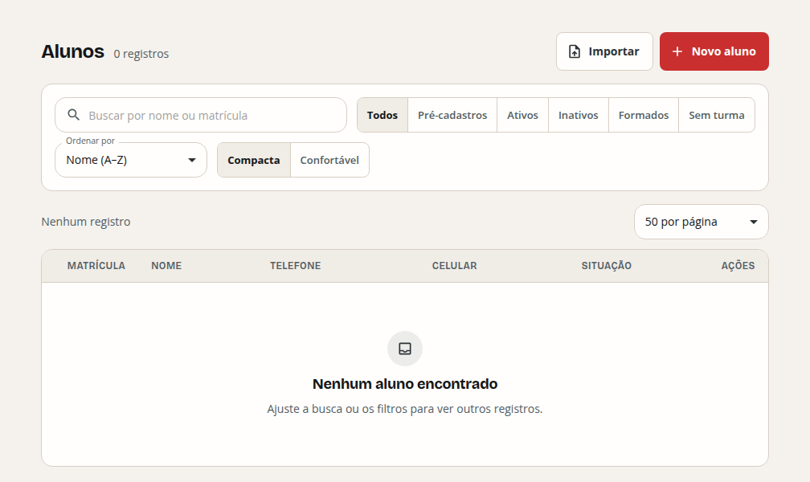

A página exibe, ao mesmo tempo:

- no cabeçalho, **"0 registros"**;
- no corpo, o estado vazio: **"Nenhum aluno encontrado — Ajuste a busca ou os
  filtros para ver outros registros."**

Uma secretária lendo essa tela conclui que **o cadastro foi apagado**. A
instrução ("ajuste os filtros") empurra para a ação errada. O único sinal de
que houve falha é o Snackbar ilegível em cima da sidebar (A3).

`Alunos.jsx` importa `EstadoVazio` (linhas 246 e 280) mas **não** `EstadoErro`,
que existe e está pronto em `ui.jsx:556`.

**Cobertura do `EstadoErro` no frontend:**

| usam `EstadoErro` (7) | não usam, mas carregam dados (17) |
| --- | --- |
| `AlunoDetalhe`, `Dashboard`, `DiarioClasse`, `FinanceiroAlunoPainel`, `FinanceiroTurma`, `TurmaDetalhe`, `Turmas` | `Alunos`, `AlunoForm`, `Calendario`, `Financeiro`, `FinanceiroConciliacao`, `ImportarAlunosDialog`, `Leads`, `Materiais`, `Materias`, `Notas`, `PortalProfessor`, `PresencasTurma`, `Professores`, `Relatorios`, `TurmaProfessor`, `Usuarios`, `WhatsApp` |

## D2 — MÉDIO — Onde o erro aparece, ele aparece **junto** com o estado vazio

`/financeiro` usa alerta inline (melhor que `/alunos`), mas mostra as duas
mensagens ao mesmo tempo:

> ⚠ Failed to fetch — **Tentar novamente**
> …
> **Nenhuma cobrança neste recorte** — Ajuste os filtros ou gere as cobranças
> pelo plano da turma.

"Falhou" e "está vazio" são estados mutuamente exclusivos. Apresentados juntos,
nenhum dos dois é crível. Além disso os quatro `CardMetrica` do topo
**desaparecem** (nem esqueleto nem placeholder), e o layout salta.

## D3 — MÉDIO — Durante o carregamento o cabeçalho exibe zeros como se fossem fatos

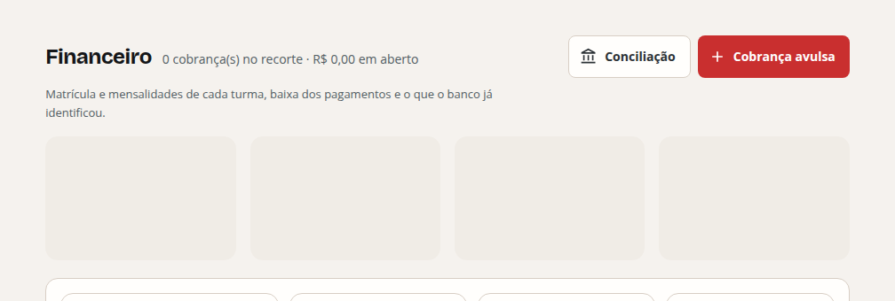

Enquanto os esqueletos da tabela rodam, o cabeçalho de `/financeiro` já afirma
**"0 cobrança(s) no recorte · R$ 0,00 em aberto"**. Segundos depois vira
"189 cobrança(s) · R$ 27.259,20". O mesmo em `/alunos` ("0 registros").

Um zero é um dado. Exibi-lo antes de saber é pior que exibir um esqueleto — e
o resto da página faz certo, com esqueletos que têm a forma exata da tabela
final (um ponto forte, ver **K3**).

## D4 — MÉDIO — Mensagem de erro técnica em inglês chega ao usuário final

Em toda falha de rede o texto exibido é literalmente **"Failed to fetch"** — a
string do `TypeError` do `fetch`. Aparece no Snackbar de `/alunos` e no alerta
inline de `/financeiro`, num produto inteiramente em pt-BR.

**Correção:** mapear a falha de rede para uma mensagem própria em `api.js`,
antes de chegar à UI.

## D5 — MÉDIO — Alvo do botão "estornar": 65,8 × **18,6px**

`pages/FinanceiroAlunoPainel.jsx:390-396`. O botão herda `resetBotao` (que traz
`minHeight: TOV.controlHSm`, 44px) e então **desfaz a proteção** com
`minHeight: 0` no próprio `sx`. Resultado medido: **18,6px de altura** — menos
de metade do piso que a regra 5 do `DESIGN_SYSTEM.md` exige, num botão que
desfaz uma baixa de pagamento.

## D6 — MÉDIO — A gaveta de notificações mostra três preferências ligadas e um aviso de que elas não funcionam

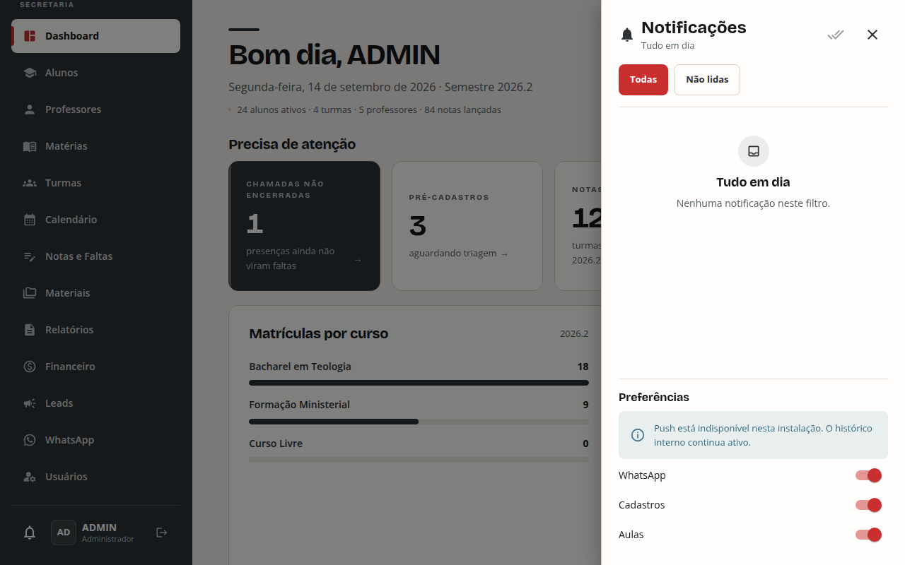

No mesmo painel:

> ℹ Push está indisponível nesta instalação. O histórico interno continua ativo.

e logo abaixo os interruptores **WhatsApp / Cadastros / Aulas todos ligados,
em coral**. O coral é o token de estado ativo. A tela afirma que três coisas
estão ativas e, uma linha acima, que elas não estão disponíveis.

Na mesma captura: a gaveta **não escurece o fundo**, ao contrário dos
diálogos, que têm backdrop — dois tratamentos diferentes para a mesma ideia de
camada sobreposta.

## D7 — BAIXO — Diálogos não têm botão de fechar

Nenhum dos nove diálogos capturados (`Novo aluno`, `Importar`, `Nova turma`,
`Nova matéria`, `Novo usuário`, `Nova aula`, `Novo lead`, `Cobrança avulsa`,
`Novo professor`) tem um `✕` no canto. A saída é só o "Cancelar" do rodapé —
que no celular, em diálogo de tela cheia com formulário de 6 etapas, fica
depois de toda a rolagem.

## D8 — BAIXO — O estado terminal de `/acesso-professor/:token` não oferece saída

Quando o professor já tem acesso, a página mostra um cartão com o alerta
"Este professor já possui acesso" e **nada mais** — sem link para o login,
sem instrução. Um beco sem saída visual.

## D9 — MÉDIO — O campo de senha usa `••••••••` como placeholder

Medido em `/login`: `input[type=password]` tem
`placeholder = "••••••••"` e `value = ""`.

Oito bolinhas num campo de senha são **indistinguíveis de uma senha já
preenchida** — é exatamente assim que o navegador mostra um valor mascarado.
Na primeira captura desta auditoria a tela foi lida como "senha já
preenchida"; só a medição do DOM desfez o engano.

Na mesma tela, o campo "Usuário" está focado no carregamento (medido:
`document.activeElement`), então o produto **abre** com um campo cercado pelo
anel coral — que, por **C4**, é visualmente igual ao estado de erro. A
primeira impressão do sistema é um formulário que parece ter sido recusado.


---

# E. Consistência do sistema de design

## E1 — ALTO — Dois vocabulários de rótulo de campo convivem na mesma linha

Este é o desalinhamento visual mais repetido do produto.

Um `TextField` do MUI encolhe o rótulo para o entalhe da borda **quando tem
valor** (ou `startAdornment`, ou `shrink`). Quando está vazio, o rótulo fica
dentro da caixa, no corpo do texto. O produto usa `select` com valor `''`
como "todos", então **selects de filtro nunca encolhem o rótulo**, enquanto os
campos ao lado encolhem.

Resultado, com exemplos medidos:

| tela | campo com rótulo **no entalhe** | campo vizinho com rótulo **dentro** |
| --- | --- | --- |
| `/leads` (`Leads.jsx:225-240`) | "Buscar" (tem ícone → encolhe) | Status, Origem, Campanha, Funil, Consentimento |
| `/whatsapp` | "Público" (tem valor) | "Turma" (vazio) — um embaixo do outro |
| diálogo "Novo aluno" | "Status" (Ativo) | "Sexo" (vazio) — **na mesma linha** |
| diálogo "Nova aula" | "Data *" | "Turma · matéria · professor *" |
| `/agenda/:token` | — | Turma, Matéria, Professor |


A regra 9 do `DESIGN_SYSTEM.md` é exatamente sobre isso: "Um grupo de controles
vive num lugar só e num vocabulário só." Além da estética, o select vazio
**não mostra que "Todos" está selecionado** — parece um campo por preencher.

**Correção:** `InputLabelProps={{ shrink: true }}` (ou `displayEmpty` com item
"Todos" renderizado) nos selects de filtro, uniformizando para o rótulo no
entalhe.

## E2 — MÉDIO — Cinco vocabulários para "escolha única entre poucas opções"

| padrão | onde |
| --- | --- |
| `GrupoSegmentado` (o do sistema) | `/alunos`, `/financeiro/conciliacao` |
| `Tabs` do MUI | `/alunos/:id`, `/turmas/:id`, `/professor/turmas/:id` |
| pílulas coral + outline | gaveta de notificações ("Todas" / "Não lidas") |
| pílulas coral + outline que **quebram linha** | `/whatsapp`, passo 2: `Texto · Imagem · Documento · Áudio · Botões · Enquete · Carrossel` (`WhatsApp.jsx:65-71`) — sete opções que quebram deixando "Carrossel" sozinho na segunda linha |
| `Select` | "Ordenar por", "50 por página" |
| botões soltos de largura diferente | `/whatsapp`, passo 1 ("Atualizar" / "Criar instância") |

`GrupoSegmentado` foi criado justamente para substituir a "mistura de pílula
própria com select do MUI numa mesma barra" (comentário em `ui.jsx:70-76`) — e
em `/alunos` ele convive com um `Select` ("Ordenar por") e outro `Select`
("50 por página") na mesma tela.

## E3 — MÉDIO — Alturas de controle divergentes: `TurmaDetalhe` crava 44px onde o tema manda 48px

`DESIGN_SYSTEM.md`: *"Altura de controle vem da barra, não da página. […]
Página não declara `height` de controle."*

`pages/TurmaDetalhe.jsx` é o **único** arquivo do frontend que viola isso, em
5 pontos — linhas **168, 172, 176, 193, 259** — com `sx={{ height: 44 }}` em
`<Button>`. O tema define `minHeight: TOV.controlH` (48px) para `Button` de
tamanho padrão. Os botões dessa página ficam 4px mais baixos que os de todas
as outras.

## E4 — MÉDIO — Hierarquia de ação invertida em três telas

| tela | ação principal do dia | o que está em coral (contido) |
| --- | --- | --- |
| `/turmas/:id` | "Fazer chamada" (outlined) | **"Boletins (ZIP)"** — exportação em lote |
| `/professor` | "NOTAS PENDENTES 4" (cartão normal) | **"AULAS HOJE 0"** — cartão escuro de destaque, marcando um zero |
| `/financeiro/alunos/:id` | "Salvar desconto" (desabilitado, invisível) | **"Remover desconto"** — destrutivo, em coral |

No dashboard a regra é aplicada corretamente — `chaveUrgente` só destaca a
primeira pendência **com total > 0** (`Dashboard.jsx:82`). O portal do
professor não faz essa checagem e destaca "0 aulas hoje".

Além disso, a mesma dupla de ações troca de hierarquia entre páginas: "Fazer
chamada" é *outlined* em `/turmas/:id` e *contained* em `/turmas/:id/diario`.

## E5 — MÉDIO — A descrição da página cai **depois** do botão de ação no celular

Na variante `operacional` do `CabecalhoPagina` (`ui.jsx:237-266`), a ordem do
DOM é: linha (título + metadados + ações) → descrição. Em `xs` as ações ganham
`width: 100%` e quebram para a linha de baixo, então o usuário lê:

> **Calendário de aulas**
> [ + Nova aula ]
> Turmas, matérias e professores em uma única agenda

O título fica separado da própria descrição por um botão. Atinge
`/calendario`, `/financeiro`, `/materiais`, `/leads`, `/alunos` e todas as
telas de trabalho. Em `/turmas/:id` (cabeçalho feito à mão, sem
`CabecalhoPagina`) o efeito é maior: **três** botões empilhados entre o título
e a linha de metadados.

## E6 — MÉDIO — Desabilitado `contained` e desabilitado `outlined` não parecem o mesmo estado

Em `/relatorios` convivem, dentro do mesmo cartão: "Boletim" e "Histórico
escolar" desabilitados como caixas quase brancas de texto cinza-claro, e
"Boletins da turma (ZIP)" desabilitado como um **bloco cinza sólido escuro**.
São o mesmo estado com dois pesos visuais opostos.

## E7 — MÉDIO — A ação da tabela não parece acionável

Em `/usuarios`, `/professores` e `/materias`, as ações de linha são texto puro
— sem borda, sem sublinhado, sem fundo — separadas por um `·` invisível (C2):

> Gerenciar acesso · Excluir

Não há nenhuma afordância de botão. Junto com C2, lê como uma única frase.

## E8 — BAIXO — `+ Nova turma` é o único botão de criação com "+" em texto

`pages/Turmas.jsx:114`:
```jsx
acoes={<Button variant="contained" onClick={abrirForm}>+ Nova turma</Button>}
```
Os outros **15** botões de criação do frontend usam
`startIcon={<AddIcon />}`. O "+" tipográfico tem peso, tamanho e espaçamento
diferentes do ícone; lado a lado com `/alunos` a diferença é visível.

## E9 — BAIXO — Terceiro padrão de borda tracejada

Bordas tracejadas aparecem em três lugares com significados distintos: a área
de upload de `/relatorios` (zona de soltar arquivo — uso convencional), o
cartão "Criar nova turma" de `/turmas` (placeholder de criação) e o estado
vazio de `/presenca/:token` (ausência de dados). O `EstadoVazio` do sistema
(`ui.jsx:522`) não usa tracejado em lugar nenhum.

## E10 — BAIXO — Dois idiomas de botão de marca na mesma linha

Em `/alunos/:id` a primeira linha de ações tem "Enviar mensagem" em coral
contido (com ícone do WhatsApp) ao lado de "WhatsApp" em outline **verde**
(`TOV.whatsappGreen` `#176B61`, também com ícone do WhatsApp). Duas ações com o
mesmo ícone, duas famílias de cor, e a mais chamativa não é a que leva ao
WhatsApp.

## E11 — MÉDIO — Três vocabulários para o link "voltar", copiado em sete arquivos

| padrão | arquivos |
| --- | --- |
| `‹ Voltar para …` (chevron tipográfico, grafite) | `AlunoDetalhe.jsx:119`, `FinanceiroAluno.jsx:26`, `FinanceiroConciliacao.jsx:143`, `FinanceiroTurma.jsx:220`, `TurmaDetalhe.jsx:159` |
| `←` (`ArrowBackRoundedIcon`, grafite) | `PresencasTurma.jsx:194` |
| `←` (`ArrowBackRoundedIcon`, **coral**) | `DiarioClasse.jsx:211`, `/professor/turmas/:id` |

Não é só a aparência: o mesmo bloco de ~5 linhas com o mesmo `sx`
(`{ ...resetBotao, minHeight: 44, px: 0.5, display: 'inline-flex', … }`) está
**copiado literalmente** em quatro desses arquivos. Não há componente
compartilhado para o gesto mais repetido de navegação do produto, embora
`ui.jsx` exporte componentes para praticamente todo o resto.

## E12 — MÉDIO — `/materias` põe a busca no cabeçalho, fora da `BarraFiltros`

Regra 9 do `DESIGN_SYSTEM.md`: *"Busca, recorte, ordenação e densidade ficam na
mesma barra; o cabeçalho fica com criação e importação."*

`/materias` coloca o campo "Buscar matéria" **ao lado de "Nova matéria"**, na
linha de ações do cabeçalho, e não tem `BarraFiltros`, nem controle de
densidade, nem paginação — enquanto `/alunos`, `/leads` e `/financeiro` têm os
três. Duas telas de lista com anatomias diferentes.

## E13 — BAIXO — O enum cru do backend vira rótulo de selo

`pages/TurmaProfessor.jsx:236` imprime `{aula.status}` direto:
**"REALIZADA"**, **"AGENDADA"**, **"CANCELADA"** em caixa alta. O mesmo dado
aparece como "Realizada", "Agendada", "Cancelada" na agenda
(`pages/CalendarioGrade.jsx:27-31`, que tem o mapa `STATUS`) e como "Realizada"
no calendário do celular. Três telas, dois rótulos para o mesmo valor.

## E14 — BAIXO — Duas ações coral contidas competindo na mesma tela

| tela | as duas primárias |
| --- | --- |
| `/financeiro/turmas/:id` | "Gerar cobranças" (cabeçalho) e "Salvar plano" (rodapé do cartão), ambas coral contidas, separadas por ~460px |
| diálogo "Importar alunos" | "Escolher pessoas" (coral contida) e "Importar todas" (outline) no primeiro cartão; "Selecionar arquivo" (outline), "Importar arquivo" (contida desabilitada, ilegível) no segundo; "Fechar" (outline) no rodapé — **quatro tratamentos de botão em um diálogo** |

No diálogo de importação, "Nenhum arquivo selecionado" é renderizado como
texto `caption` na mesma linha de base dos dois botões e com o mesmo
espaçamento, então lê como um terceiro botão desabilitado.


## E15 — BAIXO — A coluna "Cursou" da grade de notas é uma faixa de interruptores coral

Em `/notas`, com turma e matéria escolhidas, a última coluna traz um
`Switch` por aluno, ligado por padrão. Medido: **9 interruptores**, todos com
o polegar em `rgb(201,47,47)`. Coral é o token de ação/seleção; usado como
*estado padrão de toda linha*, ele vira uma listra vermelha vertical ao lado
da grade — o elemento mais chamativo de uma tela cujo foco é digitar notas.


## E16 — MÉDIO — A coluna "Nome" de `/turmas/:id` é coral por padrão — e contradiz o cartão do mesmo arquivo

No desktop, **toda** a coluna NOME da aba "Alunos" sai em `TOV.coral`
`#C92F2F`. Uma tabela inteira de dados na cor que o `DESIGN_SYSTEM.md`
reserva a "ação, seleção/estado ativo e alerta crítico".

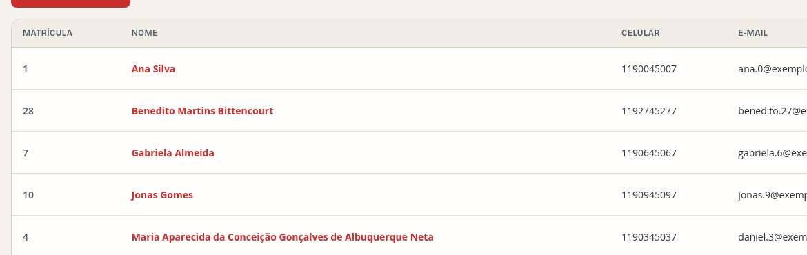

A contradição está dentro do mesmo arquivo, 34 linhas de distância:

| | `pages/TurmaDetalhe.jsx` | cor |
| --- | --- | --- |
| versão em **cartão** (celular) | linha **206** | `color: TOV.ink`, `&:hover → TOV.coral` ✔ |
| versão em **tabela** (desktop) | linha **240** | `color: TOV.coral`, `&:hover → TOV.coralHover` ✘ |

É o mesmo link, para a mesma rota, com o mesmo texto — grafite no celular,
coral no desktop. O padrão "tinta em repouso, coral no hover" aparece em
**22 lugares** do frontend; a linha 240 é a única exceção, e está numa tabela
inteira.


---

# F. Tipografia e escala

## F1 — ALTO — Aumentar a fonte padrão do navegador quebra a proporção da interface

Medido com a raiz do documento em 32px (equivalente a "muito grande" nas
preferências do navegador, um ajuste de acessibilidade comum):

| elemento | 16px (padrão) | 32px (200%) | escalou? |
| --- | --- | --- | --- |
| `<html>` | 16px | 32px | — |
| rótulo de `<Button>` | 14px | **28px** | **sim** |
| `<h1>` (`operacional`) | 24px | 24px | não |
| célula de tabela | 14px | 14px | não |
| `<body>` | 14px | 14px | não |
| item da navegação lateral | 14px | 14px | não |

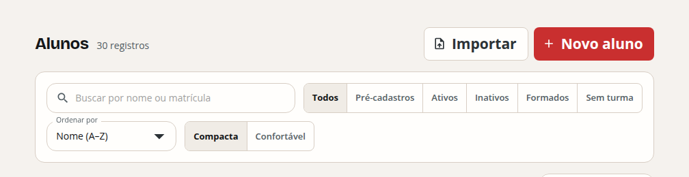

A escala tipográfica do sistema (`TOV.type.*`) é toda em **px**, então não
responde ao ajuste. Mas os componentes do MUI que mantêm o padrão em `rem`
(`typography.button` herda `0.875rem`, pois o tema só define
`textTransform`, `fontWeight` e `letterSpacing` — `theme.js:201`) **respondem**.
O resultado é uma tela em que os botões incham sozinhos, desproporcionais ao
título e à tabela: na captura, com a raiz em 24px, "Importar" e "Novo aluno"
ficam com rótulo maior que a maioria dos textos da página.

`h1`/`h2` usam `clamp(…rem, …vw, …rem)` (`theme.js:180-193`) e escalam — então
o comportamento é inconsistente **dentro da própria escala**.

**Correção:** escolher um lado. Ou toda a escala em `rem` (acessível, e aí
`TOV.type` vira múltiplos de `0.0625rem`), ou pinar também
`typography.button`/`body1`/`body2` em px para que nada escale sozinho.

## F2 — MÉDIO — Ver **C5**: 11px e 10px como corpo de texto

## F3 — BAIXO — Saltos de nível de título (`h1` → `h3`)

Detectado em todas as 12 larguras:

| rota | salto | elemento |
| --- | --- | --- |
| `/financeiro/alunos/:id` | h1 → h3 | "Desconto na mensalidade" |
| `/materiais` | h1 → h3 | "Nenhum material anexado" (dentro de `EstadoVazio`) |
| `/notas` | h1 → h3 | "Selecione uma turma e uma matéria" |

Vem do `variantMapping` do tema (`theme.js:222`), que mapeia `h4 → h3`:
`EstadoVazio` usa `variant="h4"` (`ui.jsx:549`) e sai como `<h3>` numa página
cujo último título foi o `<h1>`.

## F4 — BAIXO — A hora do evento é maior que o assunto no calendário móvel

Na agenda (`pages/CalendarioGrade.jsx`), a primeira linha do bloco é
`{hora} {turma_nome}` em **peso 700**, e a matéria — o que distingue uma aula
da outra — vem na segunda linha em peso normal. Pior: a primeira linha
**quebra** em até 3 linhas enquanto a segunda tem
`whiteSpace: 'nowrap'` + `textOverflow: 'ellipsis'` (`:182`). O dado menos
específico ganha espaço ilimitado; o mais específico é truncado.

## F5 — BAIXO — Não há folha de estilo de impressão

`grep` por `@media print` em todo o `frontend/src`: **zero ocorrências**.
Confirmado renderizando `/alunos` com a mídia de impressão emulada:

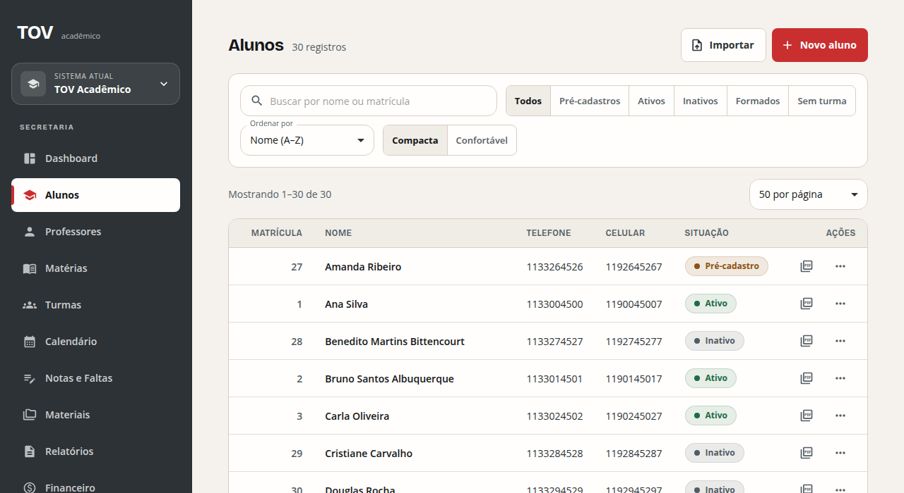

Vai para o papel: a sidebar grafite de 272px (um quinto da folha em tinta
chapada), o campo de busca, os seis filtros segmentados, o seletor "50 por
página" e a coluna AÇÕES com botões de ícone que no papel não querem dizer
nada. Nada é escondido, nada é reordenado.

O produto gera PDFs pelo servidor para os relatórios formais, o que cobre o
caso principal — mas imprimir uma lista filtrada direto da tela é um gesto
natural numa secretaria, e hoje o resultado é esse.

---

# G. Alvos de toque e teclado

`DESIGN_SYSTEM.md`, regra 5: *"Preservar alvos interativos de pelo menos 44px."*
Medições do DOM, já descontados os `input` internos do MUI (cuja superfície
clicável é o wrapper):

## G1 — MÉDIO — Alvos abaixo de 44px

| medida mínima | ocorrências | rotas | elemento |
| --- | --- | --- | --- |
| **65,8 × 18,6px** | 14 | `/financeiro/alunos/:id` | "estornar" (ver **D5**) |
| 42 × 42px | 357 | `/financeiro` | caixa de seleção de linha |
| 99 × 38px | 24 | `/financeiro/alunos/:id`, `/financeiro/conciliacao` | interruptor |
| 62–99 × **42px** | 95 | `/alunos`, `/financeiro/conciliacao` | **todas as opções do `GrupoSegmentado`** |
| **37,3** × 44px | 77 | `/materias`, `/professores` | "Editar" |
| **38,9** × 44px | 168 | `/leads` | "Editar" |
| **42,0** × 44px | 105 | `/materias`, `/professores`, `/usuarios` | "Excluir" |
| **42,1** × 44px | 28 | `/professores` | "Criar acesso" |

O caso do `GrupoSegmentado` é estrutural: o container tem
`height: TOV.controlHSm` (44px) **e** `border: 1px` (`ui.jsx:84-85`), e as
opções internas usam `alignSelf: 'stretch'` (`ui.jsx:102`) — sobram 42px.
Corrigir na origem conserta 95 alvos de uma vez (`box-sizing`/`minHeight` no
item, ou 46px no container).

## G2 — MÉDIO — As 30 linhas de `/alunos` são clicáveis com o mouse e inalcançáveis pelo teclado

Medido em `/alunos` a 1280px:

```
linhas na tabela: 30
linhas com cursor: pointer: 30
linhas focáveis (tabindex ou <a> interno): 0
role: null   aria-label: null
```

A linha tem `cursor: pointer` — promete clique — mas não é focável, não tem
`role` nem handler de teclado. A ordem de Tab pula direto da barra de filtros
para os dois botões de ação de cada linha ("Boletim em PDF de…", "Mais ações
para…"). **Abrir a ficha de um aluno pelo teclado é impossível a partir da
lista.** É a única página com linhas clicáveis; `/professores`, `/materias`,
`/leads`, `/usuarios`, `/financeiro`, `/turmas/:id` e `/turmas/:id/diario` têm
linhas não clicáveis e não sofrem disso.

Agrava: a **única forma rotulada** de abrir a ficha de um aluno é "Abrir ficha",
dentro do menu de reticências da coluna AÇÕES — dois cliques, atrás de um
ícone `…`. A ação principal da tela de alunos está ou num clique de linha sem
rótulo e sem teclado, ou escondida em um menu de estouro.

## G3 — BAIXO — Anel de foco: funciona, com uma ressalva

O rastreamento de 26 tabulações em `/alunos` mostrou anel de foco correto
(`3px solid rgba(201,47,47,.25)`) em **todos** os botões, e o `Select` recebe
o anel via `box-shadow` no wrapper `.MuiOutlinedInput-root` — verificado
diretamente, **não é** um defeito. A ressalva é C4: esse anel é vermelho e se
confunde com erro.

## G4 — BAIXO — Dois campos sem rótulo acessível

`<textarea>` sem `label`/`aria-label` associado, em 36 combinações, na página
`/cadastro-professor/:token`. Os `input.MuiSelect-nativeInput` reportados pela
sonda são internos do MUI e **não** são defeito.

## G5 — BAIXO — Nenhuma imagem sem `alt`

Varredura das 348 combinações: zero `` sem atributo `alt`. Vale registrar
— é um acerto (ver **K**).

---

# H. Layout, densidade e uso do espaço

## H1 — MÉDIO — Cartões da mesma linha esticados por um vizinho mais alto

No dashboard, a grade `{ xs: '1fr', md: '1.55fr 1fr' }` (`Dashboard.jsx:138`)
estica "Matrículas por curso" à altura de "Atividade recente". Com 3 cursos, o
cartão fecha as barras por volta de 420px e segue vazio por mais **~200px** em
1920px, ~330px em 1280px. O mesmo padrão em `/materiais` (barra de filtros com
90px de vazio à direita) e `/usuarios`.

## H2 — MÉDIO — `/usuarios` usa 700px de largura para nada

A tabela tem duas colunas — USUÁRIO e AÇÕES. Em 1280px sobram ~700px de vazio
entre o selo de perfil e os links de ação, que ficam colados na borda direita.
A relação entre um usuário e suas ações depende de o olho atravessar a tela.


## H3 — MÉDIO — A grade do calendário dedica ~40% da altura a dias vazios

`minHeight: 118` por célula (`pages/CalendarioGrade.jsx:159`) e altura de linha
ditada pelo dia mais cheio: com 3 aulas numa quarta, a semana inteira fica com
219px, incluindo domingo e sábado sem nada. Em `/agenda/:token` a 1280px isso
é quase metade da tela.

## H4 — MÉDIO — Distribuição de colunas ignora o que importa

`/professores` a 1280px: NOME quebra em 4 linhas ("Pra. Ana / Cláudia /
Figueiredo / Mendonça") enquanto SIGLA, ACESSO e ÁREAS INDICADAS — todas com
"—" em quase toda linha — mantêm largura fixa. As alturas de linha variam de
82 a 96px com a densidade em "Compacta". Mesmo padrão em `/alunos` a 768px.

## H5 — MÉDIO — Cabeçalho de `/alunos/:id` sem eixo comum

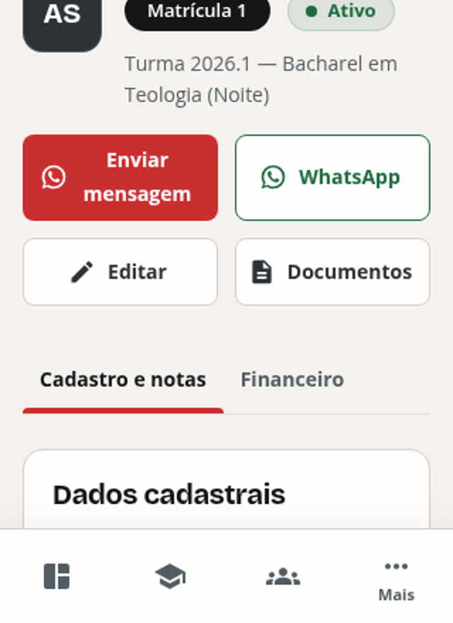

O avatar de 76px é centralizado verticalmente contra um bloco que começa no
topo (régua + nome + selos + turma), formando um "L". Logo abaixo, "Enviar
mensagem" quebra em duas linhas enquanto "WhatsApp", ao lado, fica em uma — os
dois botões da mesma linha têm pesos visuais diferentes e os ícones ficam
centralizados contra alturas distintas.

## H6 — BAIXO — O separador `·` dos metadados vira marcador órfão no início da linha

Em `CabecalhoPagina` variante `editorial` (`ui.jsx:288-300`), o ponto de 4px
que separa descrição e metadados é renderizado **junto do metadado**. Como o
bloco de texto tem `maxWidth: 760`, a descrição quase sempre ocupa a linha
inteira e o metadado desce — levando o ponto consigo, agora **liderando** a
linha:

> Segunda-feira, 14 de setembro de 2026 · Semestre 2026.2
> · 24 alunos ativos · 4 turmas · 5 professores · 84 notas lançadas

Visível no dashboard em **todas** as larguras, de 320px a 1920px. O comentário
no código explica que juntar ponto e metadado foi deliberado, "quando a linha
quebra, os dois descem juntos e o separador não fica órfão no fim" — resolveu
o órfão no fim e criou um no começo.

## H7 — BAIXO — Cinco filtros empilhados ocupam 2,5 telas antes do primeiro lead

`/leads` a 320px: busca + Status + Origem + Campanha + Funil + Consentimento,
todos em largura total e 44px, somam ~900px antes de qualquer dado.

## H8 — BAIXO — Ações de `/whatsapp` empilham com larguras diferentes no celular

"Atualizar" e "Criar instância" quebram para linhas separadas mantendo cada um
a largura do próprio texto, produzindo uma escada irregular à esquerda.

## H9 — BAIXO — O hover da linha de tabela é um tingimento de 3,5%

Medido com o cursor sobre a segunda linha de `/alunos`:

```
background-color: rgba(0,0,0,0) → rgba(44,50,54,0.035)
```

`theme.js:411` usa `alpha(TOV.graphite, 0.035)`. Sobre `#FFFEFC` isso dá
~`rgb(247,247,246)` — uma diferença de luminância de cerca de 3%. É o retorno
visual mais fraco do sistema, e pesa mais do que pareceria: em `/alunos` a
**linha inteira é o alvo de clique** (ver **G2**), e esse tingimento de 3,5%
mais o `cursor: pointer` são a única indicação disso.

Para comparação, no mesmo teste o botão outline troca a borda inteira para
grafite, o contido escurece o coral, e a ação de texto vira coral — todos
sinais claros.


## H10 — MÉDIO — Na grade de notas, o cabeçalho ocupa a altura de quase três alunos

Medido em `/notas` com turma e matéria escolhidas, em 768px **e** em 1280px
(idêntico nas duas):

| | altura |
| --- | --- |
| linha de cabeçalho | **165px** |
| linha de aluno | **61px** |

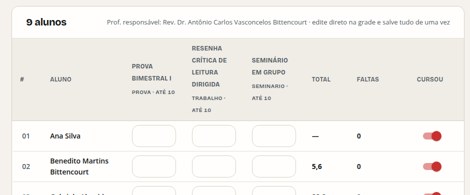

O cabeçalho vale 2,7 linhas de aluno. A causa é a combinação de nome completo
da atividade + linha de metadados (`Trabalho · até 10`), em caixa alta, dentro
de colunas de **largura fixa de 120px** — "Resenha crítica de leitura
dirigida" quebra em cinco linhas.

As larguras não se ajustam com a tela:

| coluna | 768px | 1280px |
| --- | --- | --- |
| # | 60px | 60px |
| **Aluno** | **140px** | **164px** |
| cada atividade | 120px | 120px |
| Faltas | 120px | 120px |
| Cursou | 110px | 110px |

A coluna **Aluno** é mais estreita que "Faltas" em 768px, e o nome do aluno
quebra — enquanto as três colunas de atividade, os campos numéricos de dois
dígitos, mantêm 120px cada. A largura extra de 1280px vai quase toda para o
espaço morto à direita.


## H11 — BAIXO — Três margens esquerdas diferentes no formulário público de cadastro

Medido em `/cadastro-professor/:token` a 1280px:

| elemento | borda esquerda |
| --- | --- |
| título "Cadastro de professor" (faixa escura) | **226px** |
| cartão do formulário | **214px** |
| campos dentro do cartão | **247px** |

Numa página de coluna única, nada se alinha com nada: o título da faixa fica
12px à direita do cartão e 21px à esquerda dos campos.

Some-se a isso o texto de ajuda: o tema define
`MuiFormHelperText: { marginLeft: 4 }` (`theme.js:358-359`), então **todo** texto
de ajuda do produto começa 4px à direita da borda do campo que explica —
medido em 251px contra 247px do campo.

Na mesma tela, as linhas de campos também não têm ritmo: uma linha com um
campo inteiro, uma com dois, uma com **um campo de meia largura e 390px de
vazio à direita** ("Outro telefone"), uma com o textarea inteiro, uma com três.


## H12 — BAIXO — A composição de duas faixas do login se desfaz acima de 1600px

O painel escuro do `/login` tem largura máxima fixa; a faixa clara não. Medido:

| largura da janela | painel escuro | % da tela | cartão de acesso |
| --- | --- | --- | --- |
| 1024px | 471px | 46% | 553px |
| 1280px | 589px | 46% | 440px |
| 1920px | **640px** | **33%** | 440px |
| 2560px | **640px** | **25%** | 440px |

Até 1400px é uma composição editorial de duas metades. Em 2560px vira uma
tira escura de 640px e 1920px de canvas vazio com um cartão de 440px flutuando
no meio. O título também para de crescer em 34px e continua quebrando em três
linhas dentro de um painel que tem 270px de largura sobrando.


## H13 — ALTO — O "cabeçalho fixo" das tabelas nunca fixa

Regra 6 do `DESIGN_SYSTEM.md`: *"Tabelas usam cabeçalho fixo e divisores
sutis."* O tema implementa a promessa — `MuiTable` tem
`defaultProps: { stickyHeader: true }` (`theme.js:372`) e o `th` sai com
`position: sticky; top: 0; z-index: 2` (medido). **E ainda assim ele nunca
gruda.**

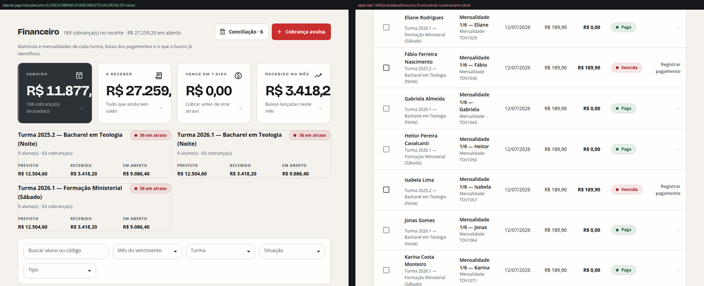

Medido em `/alunos`, `/financeiro` e `/leads` a 1280×800, rolando a página
900px:

| rota | `top` do `th` antes | depois de rolar 900px | continua visível? |
| --- | --- | --- | --- |
| `/alunos` | 311px | **−589px** | não |
| `/financeiro` | 824px | **−76px** | não |
| `/leads` | 255px | **−645px** | não |

**Causa.** `position: sticky` gruda no ancestral que rola. Aqui o ancestral é
o `MuiTableContainer`, que tem `overflow: auto` — mas **sem `max-height`**, ele
nunca rola verticalmente (medido: `scrollHeight > clientHeight` é falso nas
três rotas). Quem rola é a página, e para a página o container é um bloco
comum: o cabeçalho sobe junto e sai de cena.

O custo é maior onde a tabela é mais densa. Em `/financeiro`, depois de rolar,
o usuário encara duas colunas de dinheiro lado a lado — `R$ 189,90` e
`R$ 0,00` — **sem nenhum rótulo dizendo qual é VALOR e qual é SALDO**, em oito
colunas sem cabeçalho.

**Correção:** dar ao container uma altura máxima (`calc(100vh − …)`) para que
ele seja de fato o elemento que rola — que é o que `stickyHeader` do MUI
pressupõe. Alternativa: abrir mão do `stickyHeader` e assumir que a tabela
rola com a página, corrigindo também a regra 6 do documento.


---

# I. Texto na interface

## I1 — MÉDIO — "Turma Turma 2026.1 — …"

`pages/FinanceiroAluno.jsx:32`:
```jsx
descricao={aluno?.turma_nome ? `Turma ${aluno.turma_nome}` : 'Sem turma vinculada'}
```
Os nomes de turma já começam com "Turma". A tela mostra
**"Turma Turma 2026.1 — Bacharel em Teologia (Noite)"**.

## I2 — MÉDIO — "Olá, Rev." — a saudação do professor usa o primeiro token do nome

Em `/professor`, o cabeçalho de "Rev. Dr. Antônio Carlos Vasconcelos
Bittencourt" sai como **"Olá, Rev."**. Num seminário teológico, nomes
começando por Rev./Pr./Pra./Prof./Dr. são a regra, não a exceção — a saudação
cumprimenta o título, não a pessoa.

## I3 — MÉDIO — Pluralização "(s)" convive com pluralização correta

O dashboard faz certo (`Dashboard.jsx:70-78`):
`${dados.alunos_ativos === 1 ? 'aluno ativo' : 'alunos ativos'}`.
Em 14 outras strings o produto usa a forma de formulário burocrático:

```
"189 cobrança(s) no recorte"      "108 cobrança(s) atrasada(s)"
"9 aluno(s) · 63 cobrança(s)"     "2 matéria(s)"
"6 recebimento(s)"                "2 pendente(s)"
"mensagem(ns) de teste adicionada(s) à fila"
"${ajuste.criadas} criada(s)"     "${ajuste.preservadas} preservada(s)"
```

`"mensagem(ns)"` é o caso extremo. Duas vozes no mesmo produto, às vezes na
mesma tela (`/financeiro` tem "189 cobrança(s)" no cabeçalho e "24 alunos
ativos" vindo do dashboard).

## I4 — MÉDIO — Tela de operação expõe nome de variável de ambiente e rota interna

`/financeiro/conciliacao` mostra, num alerta informativo, para quem cuida da
tesouraria:

> O banco ainda não está conectado. Defina **`TOV_BANCO_WEBHOOK_SECRET`** no
> servidor e aponte o provedor para **`/integracoes/banco/recebimentos`**.

É instrução de operador em tela de usuário final.

## I5 — BAIXO — `/presenca/:token` pode exibir duas mensagens contraditórias

Com a chamada aberta e a lista ainda vazia, a tela mostra
"Todas as presenças foram confirmadas." no subtítulo e, logo abaixo,
"A lista ainda está vazia — Peça à secretaria para conferir os alunos desta
turma."

## I6 — BAIXO — Identificadores internos na interface

`/turmas` mostra `#3`, `#1`, `#2`, `#4` — o `cod_tur` do banco — como selo de
cada cartão. `/materias` mostra `MT-06`, `MT-04`, `MT-01`, `MT-03`, `MT-05`,
`MT-02` na primeira coluna, e `/professores` mostra `05`, `02`, `04`, `01`.
Em todos os casos a ordenação é por **nome**, então a coluna de código — que
parece uma sequência — aparece embaralhada, o que lê como defeito de dados.

## I7 — BAIXO — "Bacharel em Teologia · Bacharel em Teologia"

`pages/TurmaProfessor.jsx:162`:
```jsx
descricao={[vinculo.turma_nome, vinculo.curso, periodo].filter(Boolean).join(' · ')}
```
O nome da turma já contém o curso, então a linha sai como
**"Turma 2026.1 — Bacharel em Teologia (Noite) · Bacharel em Teologia · 2026/2"**.
Mesma família de **I1**: o nome da turma é tratado como se fosse um rótulo
curto e ganha prefixo ou sufixo redundante.


## I9 — BAIXO — Nome do professor e instrução de uso ligados por um `·`

`/notas`, cabeçalho da grade:

> Prof. responsável: Rev. Dr. Antônio Carlos Vasconcelos Bittencourt ·
> edite direto na grade e salve tudo de uma vez

e, no celular:

> Prof. responsável: Rev. Dr. Antônio Carlos Vasconcelos Bittencourt ·
> alterações não salvas ficam com filete âmbar

Um dado (quem responde pela matéria) e uma instrução de interface viram uma
frase só, separados pelo mesmo `·` que o produto usa para separar metadados
homogêneos. Em 390px a frase ocupa três linhas e o nome do professor se perde
no meio da instrução.


---

# J. Fontes e primeira pintura

## J1 — MÉDIO — Nenhuma fonte é pré-carregada; há FOUT observado

`frontend/src/fonts.css` declara **7 `@font-face`** com `font-display: swap`,
e `frontend/index.html` não tem **nenhum** `<link rel="preload" as="font">`.
Confirmado no DOM: a lista de `<link>` da página traz `modulepreload` para 30+
chunks de JS, `stylesheet`, `manifest`, ícones — e zero fontes.

Consequência: os arquivos WOFF2 só são descobertos depois do CSS ser baixado e
parseado, e `swap` pinta o texto na fonte de fallback nesse meio-tempo.
**Aconteceu numa das capturas desta auditoria**, já depois de `networkidle` +
1200ms: em `/financeiro` a 768px, os cartões de turma renderizaram na fonte
de sistema enquanto os títulos já estavam em Bricolage Grotesque; um novo
render veio correto. É o sintoma clássico.

**Correção:** `<link rel="preload" as="font" type="font/woff2" crossorigin>`
para os 2–3 pesos usados acima da dobra (Bricolage 700, Open Sans 400/600).

## J2 — BAIXO — Uma fonte declarada nunca é usada e entra no precache offline

`document.fonts` na aplicação carregada:

```
Bricolage Grotesque 400  → unloaded     ← nunca requisitada
Bricolage Grotesque 600  → loaded
Bricolage Grotesque 700  → loaded
Open Sans 400/500/600/700 → loaded
```

O peso 400 do Bricolage não é pedido por nenhum estilo (o tema usa 600/700 nos
títulos). O arquivo continua sendo empacotado e, por
`globPatterns: ['assets/*.{js,css,woff2}']` (`vite.config.js:16-22`), entra no
**precache do service worker** — bytes baixados na primeira visita para nunca
serem usados.

## J3 — BAIXO — Erro de CORS no console em `/whatsapp`

Em todas as 12 larguras, `/whatsapp` registra:

```
Access to fetch at 'http://.../whatsapp/templates' … blocked by CORS policy:
No 'Access-Control-Allow-Origin' header is present
Failed to load resource: 409 (Conflict)
```

O backend responde 409 sem os cabeçalhos de CORS, então o navegador trata como
falha de rede. Efeito visual: a lista de modelos não carrega e a página não
mostra nada a respeito. (Achado de origem no backend; listado aqui porque a
consequência visível está na tela.)

---

# K. Verificado e **correto** — não mexa

Hipóteses que pareciam defeito numa leitura rápida e foram medidas até o fim.
Estão no relatório para ninguém "corrigir" o que já está certo.

**K1 — No celular, o valor do `CardMetrica` não corta nem quebra — mas no
desktop corta (ver A7).**
Suspeita original: `R$ 27.259,20` em 32px num cartão de 288px a 320px, com
`overflow: hidden` no `Superficie`. Medido injetando valores no elemento real:
em 320px e 360px a altura permanece em 32px (uma linha) para `R$ 127.259,20`
**e** para `R$ 1.234.567,89` — não corta, não quebra. **Essa verificação vale
só para o celular.** Ao repetir a medição nas larguras de desktop o corte
apareceu, e virou o achado **A7**: entre 1200px e 1500px o cartão encolhe para
196–265px e o valor perde até 88px. Fica registrado como lembrete de que
medir numa faixa não autoriza conclusão nas outras.

**K2 — A lasca clara no topo-esquerdo do login é decoração intencional.**
Medida como `rgba(255,255,255,.28)`, 4 × 304px, `position: absolute` em
`top/left: 0`. É `pages/Login.jsx:59` — um acento deliberado de 38% da altura
do painel, irmão do padrão de grade da linha 58. Não é artefato de render.

**K3 — Os esqueletos de carregamento têm a forma da tabela final.**
`LinhasSkeleton` repete as colunas reais dentro do `TableBody`, então não há
salto de layout quando os dados chegam — o container, o cabeçalho e a altura
de linha já estão no lugar. É exatamente o que `ui.jsx:621-629` documenta, e
funciona.

**K4 — O anel de foco do `Select` existe.**
Parecia ausente porque `document.activeElement` é o `div[role=combobox]`
interno, cujo `outline` é `none`. O anel está no wrapper
`.MuiOutlinedInput-root`, que recebe `Mui-focused` e
`box-shadow: rgba(201,47,47,.25) 0 0 0 3px`. Verificado por medição direta.

**K5 — Os blocos de aula do calendário respeitam o alvo de toque.**
Estimativa por código dava ~35px. Medido a 768px com toque ativo:
**48,1 a 61,3px de altura**. Acima do piso.

**K6 — `mm/dd/yyyy` e `--:-- --` nos campos nativos não são culpa do app.**
Os `<input type="date">` e `type="time"` renderizaram em formato norte-americano
nas capturas. Testado lançando o Chromium com `--lang=pt-BR` e com
`--lang=en-US`: **o formato não muda** neste build headless (ICU reduzido).
O formato de exibição é decidido pelo idioma da interface do navegador, não
pela página. Num Chrome pt-BR aparece `dd/mm/aaaa`. Não é defeito do produto —
mas vale saber que a equipe não controla isso e que não há dica de formato ao
lado do campo.

**K7 — A aplicação declara `color-scheme: light` e não quebra em modo escuro.**
`theme.js:227` fixa `':root': { colorScheme: 'light' }`. Verificado renderizando
`/alunos` com `prefers-color-scheme: dark` forçado: a tela sai **pixel a pixel
igual** à versão clara — nenhum controle nativo inverte, nenhum campo escurece.
Optar por não ter tema escuro é uma decisão legítima e está implementada certo.

**K8 — `prefers-reduced-motion` é respeitado globalmente.**
`theme.js:242-248` zera `animation-duration`, `transition-duration` e
`scroll-behavior`. Cobre o produto inteiro, não caso a caso.

**K9 — `check:design` faz o que promete.**
`npm run build` roda `scripts/check-design-system.mjs` e ele passou limpo nesta
árvore. A varredura das 348 capturas não encontrou **nenhuma** cor fora dos
tokens, nenhum raio numérico multiplicado pelo `sx`, nenhum tamanho
tipográfico fora da escala. As violações listadas neste relatório são todas
de categorias que o verificador **não** cobre hoje: `height` de controle
(**E3**), alvo de toque (**G1**), contraste (**C**) e uso de token de borda
como cor de texto (**C2**).

**K10 — `safe-area-inset` é tratado.**
`Layout.jsx` usa `env(safe-area-inset-top/bottom)` na AppBar, na gaveta, na
trilha, no `main` e na barra inferior, e o `index.html` traz
`viewport-fit=cover`. Correto para iPhone com notch.

**K11 — Nenhuma `` sem `alt`, e `lang="pt-BR"` está no `<html>`.**

**K12 — O skip link existe e funciona.**
`Layout.jsx:444-458`: "Ir para o conteúdo", escondido com
`translateY(-160%)` e revelado em `:focus`. Presente em todas as telas
autenticadas.

**K13 — Os campos da grade de notas têm rótulo acessível descritivo.**
Cada `input[type=number]` da grade carrega
`aria-label="Prova Bimestral I de Ana Silva"` — atividade **e** aluno. O
interruptor traz `aria-label="Marcar se Ana Silva cursou a matéria"`. Numa
grade de 36 campos idênticos, isso é o que torna a tela navegável por leitor
de tela. Bem feito.

**K14 — O aviso de "sem conexão" é o único Snackbar bem resolvido.**
`OfflineScreen.jsx` ancora no centro inferior, usa `variant="filled"` (opaco) e
sobe 78px no celular para não cobrir a barra inferior. Testado forçando
`navigator.onLine = false` em 390px e 1280px. Ver **A3**, onde ele serve de
modelo para o resto.

**K15 — O `ErrorBoundary` existe e é sóbrio.**
`ErrorBoundary.jsx` envolve todas as rotas (`App.jsx:75-110`) e renderiza um cartão
centralizado com `role="alert"`, título, explicação de que os dados salvos
continuam seguros e um botão de recarregar. Não expõe *stack trace* ao usuário
— o erro vai só para o `console.error`. A ressalva é que a única saída
oferecida é recarregar a mesma rota que quebrou.


---

# Apêndice — instrumentação

Scripts usados (mantidos fora do repositório, no diretório de trabalho da
auditoria):

| script | o que faz |
| --- | --- |
| `serve.py` | Sobe o backend FastAPI real contra SQLite e semeia o banco de vitrine |
| `capture.js` | 29 rotas × 12 larguras, 696 capturas + `medidas.json` |
| `probe.js` | Sonda injetada: estouro, corte, alvos, contraste, títulos, rótulos |
| `contraste.js` | Passagem de contraste dedicada com composição correta de camadas alfa |
| `estados.js` | 22 cenários de estado (diálogos, gavetas, menus, abas, validação) |
| `erro.js` | Falha de API isolada (aborta só a porta 8000) |
| `tabs.js` | Rastreamento da ordem de Tab e da visibilidade do anel de foco |
| `inspect.js` | Sondas dirigidas por rota/largura |
| `analisar.py`, `an_contraste.py`, `alvos.py` | Agregação dos JSON |

**Larguras cobertas:** 320, 360, 390, 414, 600, 768, 820, 900, 1024, 1280,
1440, 1920 — mais varreduras finas em 880–920 (breakpoint `md`) e 1024–1920
(corte de tabela), e alturas 640, 700, 768, 800, 900, 1080 (sidebar).

**Perfis exercitados:** ADMIN (26 rotas), PROFESSOR (3 rotas), e as 6 rotas
públicas sem sessão.

**O que ficou de fora:** a URL de produção (bloqueada, ver topo); vídeo/animação
em movimento real (capturas são estáticas e `prefers-reduced-motion` estava
ligado); Safari e Firefox (todas as medições são Chromium 1194); e telas que
dependem de integração externa ativa (QR code do WhatsApp, webhook do banco).
